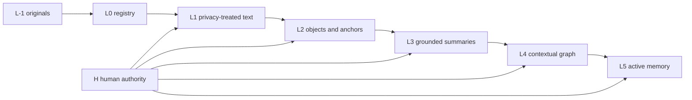
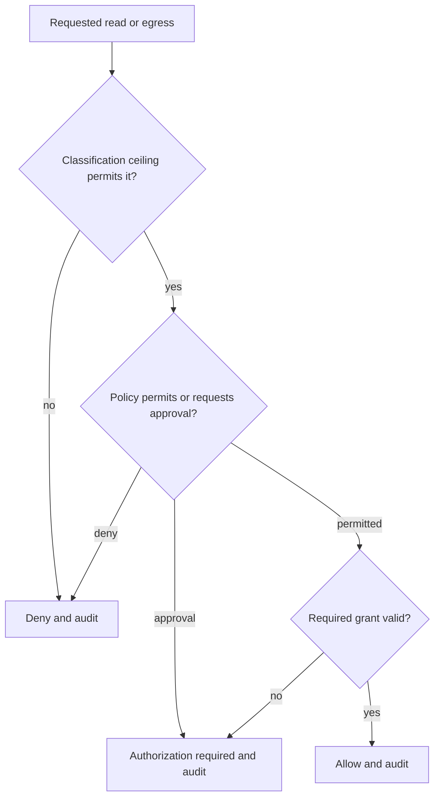

# Prateek Brain — Study Guide

> **Last updated:** 2026-09-05<br>
> **Source repository:** `prateek-brain`<br>
> **Source baseline:** canonical `main` `78324967005cccd0b36147e82647f8ef464e8918` (includes B2.6 acceptance records; corrected B2.6 implementation `2197ec7`); B2.7 in-progress evidence snapshot `721bd74ef9d6ad2a423626691361ad57d7755ad4`<br>
> **Source scope:** `docs/{ARCHITECTURE,SECURITY_MODEL,PRIVACY,DATA_MODEL,B1_SCOPE,B2_SCOPE,B2_PHASE_PLAN}.md`; `docs/adr/`; `docs/reviews/`; `migrations/`; `src/`; and `tests/`<br>
> **Documentation status:** Mixed current/future

[Documentation home](README.md) · [User guide](user-guide.md) · [Components](components/README.md) · [Status](STATUS.md)

## 1. Why Brain is separate

Prateek OS handles structured live domains and interaction workflows. Brain handles a different problem: maintaining useful memory over heterogeneous local sources without treating a hosted database or conversational agent as the owner of personal knowledge. That calls for local storage, filesystem observation, source-availability semantics, private model processing, deep provenance, and derived-state regeneration.

The repository boundary makes that trust model visible. Brain can evolve its indexing and retrieval internals independently. A future OS integration must cross an explicit contract; it does not gain direct database or filesystem authority simply because both projects belong to the same ecosystem.

## 2. Canonical sources, registry, and derived memory

Brain's central distinction is canonical versus derived:

- **L-1:** original content remains canonical and is not silently rewritten.
- **L0:** a source registry tracks identity, location/proxy metadata, availability, policy, and observation state.
- **L1:** deterministic privacy-treated text suitable for later local processing.
- **L2:** structured semantic objects, relationships, and exact source anchors.
- **L3:** distilled hierarchical summaries made of grounded atomic statements.
- **L4:** a contextual graph with nodes, edges, evidence, contradiction, supersession, and conservative identity handling.
- **L5:** a bounded, regenerable active-memory working set selected from deeper memory.
- **H:** human instructions, corrections, decisions, and selection controls that survive regeneration.



Only L-1 is original content. L1–L5 can be invalidated and rebuilt; H must not disappear during regeneration. The implementation records artifact generations and parent/input edges so a source change can stale only downstream projections that depended on the old version.

## 3. Observation and differential indexing

Local filesystem roots can use event observation plus reconciliation. Mounted or intermittently available storage uses reconciliation rather than assuming watcher semantics. Source identity uses filesystem evidence and content/metadata signals so moves, edits, duplicates, replacements, and removals have different meanings.

The change path is durable and staged:

```text
observe/reconcile → durable change event → L0 fold → L1 work
                → semantic queue → L2/L3 → L4 fold → L5 refresh
                → search-index reconciliation
```

Work queues use leases/fencing and bounded retry. Folding is differential: unchanged inputs should not rebuild unrelated artifacts. Search has its own index-state checkpoint. Supervisory cycles are bounded so a very large root or model backlog cannot monopolize every pass.

## 4. Availability is not mutation

An unavailable root is not evidence that its files were deleted. A disconnected mounted source, cloud placeholder, permission failure, or transient I/O problem defers work and marks availability; it does not tombstone children or stale derived memory. Removal requires positive observation plus grace/confirmation rules.

When a source genuinely returns after an outage, reconciliation compares current evidence. Changed items regenerate; unchanged items retain their generations. Tests use synthetic mounted-source probes to verify outage, return, move, duplication, and deletion without touching private storage.

## 5. Privacy treatment and provenance

L1 treatment is deterministic. Rules can redact or substitute sensitive patterns before semantic model processing while retaining the relationship to the canonical source. Derived outputs inherit security rather than becoming safer merely because they are summaries.

Every significant derived object records enough evidence to answer:

- which source and source version supported it;
- which parent artifacts and generation produced it;
- what pipeline, schema, prompt/template, and model/runtime version applied;
- which exact L1 span anchored a semantic object;
- whether a statement was direct, inferred, corrected, contradicted, or superseded;
- which H instruction affected it.

An example must remain synthetic. If a fictional note says “Project Juniper decision: use SQLite,” L2 may create a decision object anchored to that exact substring; L3 may summarize it only with grounding; L4 may relate the fictional project and technology while preserving the evidence edge.

## 6. Security model: three independent axes

Brain does not collapse sensitivity and permission into one flag.

1. **Intrinsic classification** describes what the material is allowed to do: `BLOCKED`, `LOCAL_RESTRICTED`, `LOCAL_ONLY`, or explicitly opted-in `CLOUD_ALLOWED`.
2. **Access policy** describes how a principal may access it: `AUTOMATIC`, `EXPLICIT`, `APPROVAL_REQUIRED`, or `DENY`.
3. **Runtime grants** represent bounded authority, including `READ_GRANT` and `EGRESS_GRANT`.

Classification is a ceiling. A grant cannot convert local-only material into cloud-allowed material, and effective `DENY` is absolute. Derived content takes the most restrictive posture across its supporting evidence. No classifier or model is allowed to infer `CLOUD_ALLOWED` from apparently harmless prose.

Every protected operation passes through a local gateway. It evaluates principal, operation, source/artifact, purpose, policy, classification, and grant; returns allow, deny, or authorization-required; and writes one append-only audit record. Audit rows store decision evidence and identifiers, not source bodies.



`READ_GRANT` and `EGRESS_GRANT` are deliberately separate. Reading locally does not imply permission to transmit. This remains true for high-level summaries and compiled context.

## 7. Local model boundary

Accepted semantic processing uses an on-device Ollama service on loopback. Deterministic code owns the lifecycle:

```text
deterministic input selection
  → gateway authorization
  → constrained local request
  → structured response
  → schema and anchor validation
  → deterministic persistence
```

The model cannot scan arbitrary files, write originals, bypass policy, or persist an unvalidated result. L2 quotes must match actual L1 substrings. Invalid relations fail closed. L3 statements require grounding, and checks reject unsupported numeric content. Model calls have bounded bodies/time and durable run accounting. Tests use deterministic fake clients for most regressions; accepted records also describe targeted real-local-model golden evaluation.

## 8. Semantic objects, graph, and active memory

L2 extracts bounded object and relationship types with direct/inferred distinctions. Source-processing roles prevent templates, metadata files, and system artifacts from polluting authored-memory semantics. L3 builds a hierarchy of summaries but stores individual grounded statements so retrieval does not depend on one opaque narrative blob.

L4 is a contextual graph stored in SQLite. Identity convergence is conservative, particularly for people: a matching label alone is insufficient. Relationships and their evidence are separate, so multiple supports can explain one edge. Contradictions and supersession remain first-class instead of being overwritten. H4 directives can confirm, reject, merge, mark distinct, correct, or supersede non-destructively.

L5 selects a bounded working set using deterministic ranking and support-aware security inheritance. Refresh uses a generation/swap pattern: an incomplete refresh cannot replace the last valid generation. H5 pin/suppress/boost controls selection rather than rewriting deeper evidence.

## 9. Search and deterministic ranking

B2.2 adds a rebuildable SQLite FTS5 index over current derived L1 text, L2 labels, and L3 statements. Bookkeeping maps every result to source, artifact, level, reference, and generation. Cached security fields help candidate filtering but are never final authority; retrieval evaluates current access policy again.

Search combines lexical score with deterministic metadata, temporal/source-role filters, and appropriate graph/active-memory signals. Results include evidence and provenance rather than only a text snippet. The system explicitly supports query classes such as exact lookup, paraphrase/conceptual discovery, temporal questions, source-scoped questions, relationship questions, contradictions, and change/history views.

The B2.5 experiment showed that local embeddings can materially improve some synthetic paraphrase queries, but also exposed false-positive and scale-validation risk. Production embeddings were therefore deferred. SQLite remains the accepted search and graph foundation; the measured workload did not justify a vector or dedicated graph database.

## 10. Claims

A claim is a query-time view over current L2–L4/H evidence, not a canonical editable table. It carries a stable derived identity, subject/predicate/object or statement shape, direct/inferred status, confidence/uncertainty, support and contradiction references, temporal validity, supersession/state, provenance, and effective security.

Compiling claims on demand avoids another stale materialized layer. New evidence, a source regeneration, an H correction, or a contradiction is visible on the next read. If future scale makes this too slow, materialization has an explicit reconsideration trigger; it is not assumed prematurely.

## 11. Context compilation

The context compiler turns a query into a bounded structured packet:


Selection is deterministic and priority-aware. The packet keeps query interpretation, selected evidence/claims, graph context, human authority, contradictions, supersession, omissions, provenance, and security visible. Its budget is an explicit count of structured context items: priority and whole-item selection matter more than squeezing in partial prose.

Compiled context is derived and regenerable. It is not an answer, a prompt transcript, or a permission token. A downstream system must still enforce access/egress policy. Patrick is therefore not allowed to treat a context packet as authorization.

## 12. Persistence and failure recovery

SQLite provides transactional local persistence, FTS5, migrations, queues, audit records, graph storage, and generation state. Content-addressed blobs hold derived text outside ordinary relational columns. Forward-only migrations preserve deterministic reconstruction from zero.

Key recovery patterns include:

- lease expiry and reclaim after worker death;
- fencing/idempotent queue operations;
- generation/swap for current projections;
- abandoned model-run cleanup;
- differential reconciliation after watcher gaps;
- bounded busy retry for SQLite contention;
- checkpoints for large root walks and search backfills;
- preserving the last valid generation when a refresh fails.

Crash-injection and multiprocess tests kill workers, reopen file databases, reclaim work, and assert that no source silently loses its current projection and no invalid partial result becomes current.

## 13. Operations and performance

The current product is operator-facing. CLI commands register/disable roots, reconcile or observe, inspect aggregate status, run semantic/graph/search stages, search, inspect claims, compile context, run security preflight and health checks, and manage local supervision.

macOS launchd definitions supervise a watcher and bounded processing cycles. Heartbeats and aggregate health identify stalled drains, unavailable roots, queue contention, accounting gaps, and model readiness without printing private content. Power/resource probes let expensive local-model work defer when conditions are unsuitable.

Performance is addressed with bounded scans, resumable frontiers, selective event emission, queue coalescing, size caps, indexes, cached policy patterns, incremental folds, and benchmark gates. The architecture prefers measured triggers over speculative infrastructure.

## 14. Testing strategy

The inspected suite includes:

- migration-from-zero and database invariants;
- path confinement, identity, watcher/reconciliation, and unavailable mounted-source semantics;
- deterministic privacy rules and source-role handling;
- gateway decisions, grant behavior, security ceilings, and append-only auditing;
- queue replay, concurrency, multiprocess contention, crash injection, and recovery;
- fake-model failure, schema validation, anchor verification, grounding, golden-corpus metrics, and targeted real-local-model evidence;
- graph identity, evidence, contradiction, supersession, H controls, stress, and L5 generation behavior;
- search backfill/reconciliation/ranking/security and benchmark invariants;
- claims evidence/state/security and CLI output;
- context budget, deterministic repeatability, contradiction visibility, provenance, and CLI behavior;
- operations, health, performance, power behavior, and filesystem accounting.

Synthetic corpora are essential: they make truth and expected relationships reviewable without committing personal memory.

## 15. Current and future boundaries

Canonical `main` includes accepted B2.0–B2.6. B2.6 adds isolated experimental/manual audit and comparison seams, not a production runtime path. Source records state that no live external comparison/audit call occurred. Any future live external call requires separate authorization and an `EGRESS_GRANT`; neither Codex nor a comparison service may become a production dependency.

B2.7 is the scale/regression/closeout phase. Its implementation-side evidence is recorded on unmerged snapshot `721bd74`, pending independent closeout review; it changed no production code and does not make B2 canonically closed. B3 plans an MCP surface and importer framework. Patrick/OS/Recall integration, Discord controls, polished UI, and historical importers are not current. A future interface may request authorized Brain operations, but Patrick remains presentation/interaction—not policy, provenance, or authorization authority.
