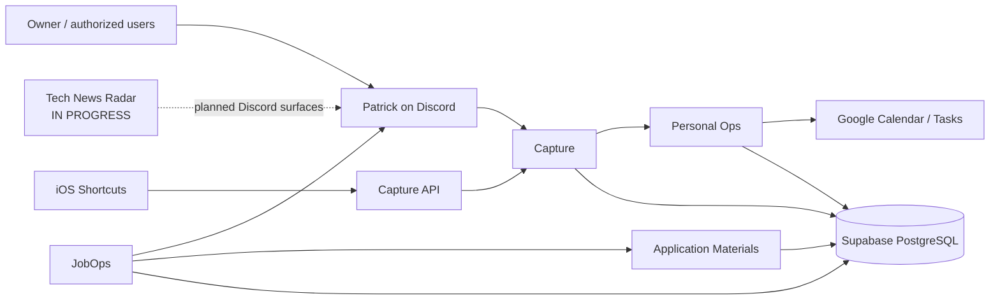

# Prateek OS

> **Last updated:** 2026-09-05 
> **Source repository:** `prateek-os` 
> **Source baseline:** canonical `main` `76edfe8635c5abf075c12e47eaa39b70f1b1bce5`; N1 in-progress feature snapshot `c111af6770bc2197ce35b2cb76179356911b39ae` (corrected code `2bd34e3`) 
> **Source scope:** `docs/{PROJECT,ARCHITECTURE,PRIVACY,MODEL_POLICY,ROADMAP,MILESTONES}.md`; `docs/source/active/`; `docs/adr/`; `docs/reviews/`; `services/`; `apps/`; `packages/`; and `supabase/migrations/` 
> **Documentation status:** Mixed current/future

Prateek OS is a private personal operating system made of focused services rather than one all-powerful agent. It currently supports low-friction capture, personal planning, job discovery and ranking, and application-material preparation. Tech News Radar is being built as the next subsystem.

The design is deterministic-first: databases, explicit rules, stable identities, and state machines remain authoritative. Raw inputs retain provenance; derived classifications and scores are rebuildable. High-consequence mutations such as Calendar writes have explicit approval gates and fail closed at those boundaries. Patrick, the Discord identity, is the interaction surface—not an authorization principal or source of truth. Supabase/PostgreSQL stores structured live state, while hosted and local runtimes are used according to workload and privacy needs.

> **Public documentation baseline — 2026-09-05.** Canonical `main` was observed at `76edfe8635c5abf075c12e47eaa39b70f1b1bce5`. N1 documentation is tied to committed feature snapshot `c111af6770bc2197ce35b2cb76179356911b39ae`, whose correction code ends at `2bd34e3`. The correction delta review and hosted reactivation/reverification are durably recorded. N1 is **IN PROGRESS — HOSTED DEV / CORRECTION VERIFIED / OWNER ACCEPTANCE PENDING**; it is not merged, deployed to PROD, or formally closed. See the concise [documentation status](STATUS.md).

## What this documentation contains

Start with the [systems index](systems/README.md) for quick navigation or the [OS Study Guide](os-study-guide.md) for the shared architecture.

### Interaction layer

**[Patrick](patrick/README.md)** is the canonical human-facing interaction identity/layer of Prateek OS. **Current:** Discord-first. **Future direction:** a coherent multi-surface interaction layer. Patrick is not a domain subsystem or authorization principal; see the [Patrick Study Guide](patrick/study-guide.md) and [Product Vision](patrick/vision.md).

### Domain systems

| System                | What it does                                                                              | Study Guide                                           | User Guide                                         | Status                           |
| --------------------- | ----------------------------------------------------------------------------------------- | ----------------------------------------------------- | -------------------------------------------------- | -------------------------------- |
| Platform / Core       | Shared monorepo, database, security, runtime, CI, and engineering patterns                | [Study](systems/platform-core/study-guide.md)         | [Use](systems/platform-core/user-guide.md)         | **IMPLEMENTED**                  |
| JobOps                | Discovers, deduplicates, ranks, and notifies about jobs                                   | [Study](systems/jobops/study-guide.md)                | [Use](systems/jobops/user-guide.md)                | **IMPLEMENTED · HOSTED DEV**     |
| Application Materials | Produces evidence-grounded resume and cover-letter packages                               | [Study](systems/application-materials/study-guide.md) | [Use](systems/application-materials/user-guide.md) | **IMPLEMENTED · RUNTIME PAUSED** |
| Capture               | Preserves and interprets Discord/mobile inputs, with deterministic and model-backed paths | [Study](systems/capture/study-guide.md)               | [Use](systems/capture/user-guide.md)               | **IMPLEMENTED · HOSTED DEV**     |
| Personal Ops          | Owns tasks, deterministic planning, approval-gated Calendar writes, and a Tasks mirror    | [Study](systems/personal-ops/study-guide.md)          | [Use](systems/personal-ops/user-guide.md)          | **IMPLEMENTED · HOSTED DEV**     |
| Tech News Radar       | Builds a personalized editorial news desk and story-selection pipeline                    | [Study](systems/tech-news-radar/study-guide.md)       | [Use](systems/tech-news-radar/user-guide.md)       | **IN PROGRESS · HOSTED DEV**     |

## Current system map

Patrick is shown above as the interaction layer connecting people to capabilities, not as another domain system. See the [Patrick documentation](patrick/README.md).

Implemented systems run against hosted **DEV**, not Supabase PROD. JobOps scheduling runs on Railway; Patrick and the optional Application Materials worker use independently supervised local runtimes. Application Materials generation is presently paused even though its accepted persistence, recovery, validation, and approval architecture remains documented.

## Roadmap / what's next

- **N1 — Tech News Radar:** hosted DEV activation from `41007e5` found user-visible defects. Corrections through `2bd34e3` passed independent delta review and hosted reactivation/reverification, as recorded through `c111af6`. Batched owner acceptance is still pending; N1 is not merged, deployed to PROD, or formally closed.
- **R1 — Reference Library, Y1 — YouTube Analyst, CR1 — Creator Intelligence, W2, PI1, OS1, PX1, OS2:** scheduled future OS-track milestones.
- **J3 — JobOps CRM / outreach / follow-ups / interview preparation:** scheduled late because current JobOps is operationally sufficient.
- **C4 — Capture Refinement & Extensions** and **RC1 — Recall:** scheduled at the roadmap tail; C4 is deliberately unfrozen, while Recall is defined only as a future provenance-preserving read side over existing systems.
- The separate [Prateek Brain](../prateek-brain-docs/README.md) track has its own repository and lifecycle. Patrick does not currently read from it. General News Radar, price monitoring, call capture, physical-item archiving, and other concepts remain future/unscheduled.

The public portfolio is documented separately as [Prateek Web](../prateek-web-docs/README.md); its runtime does not depend on Prateek OS.

## Documentation philosophy

Implementation repositories remain authoritative for code and current engineering state. This public repository explains the architecture, user workflows, tests, tradeoffs, and reusable lessons. Repository paths are included as provenance even when the implementation repository is private. Security-sensitive configuration, personal data, private source inventories, full production prompts, and exact private preference profiles are intentionally omitted.
