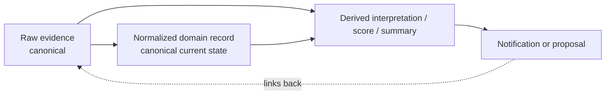
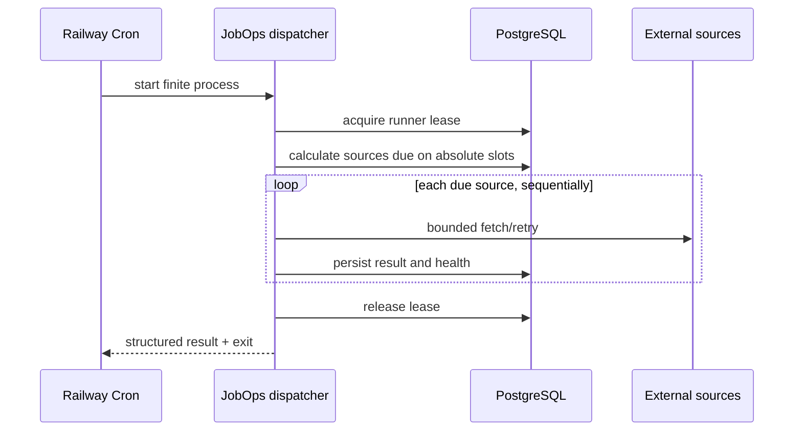
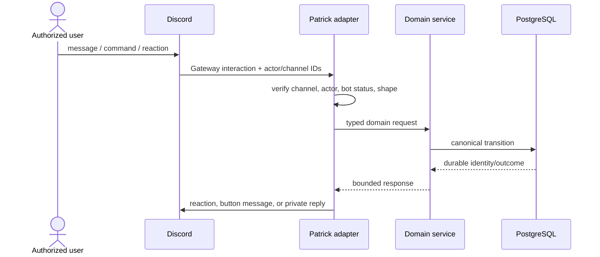
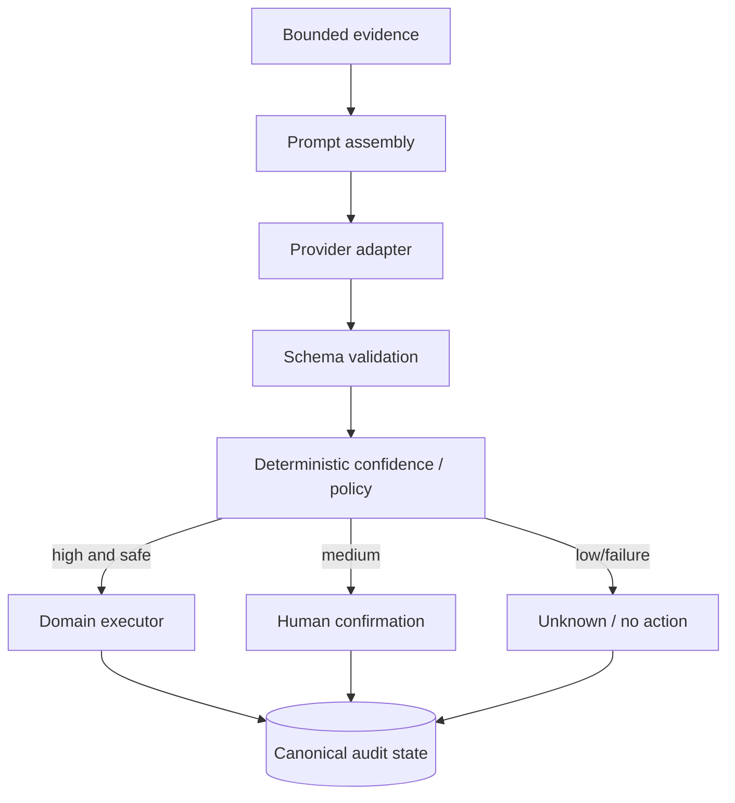
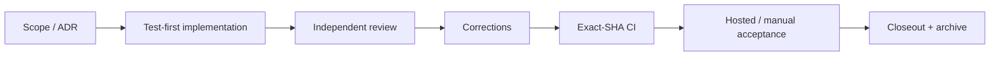
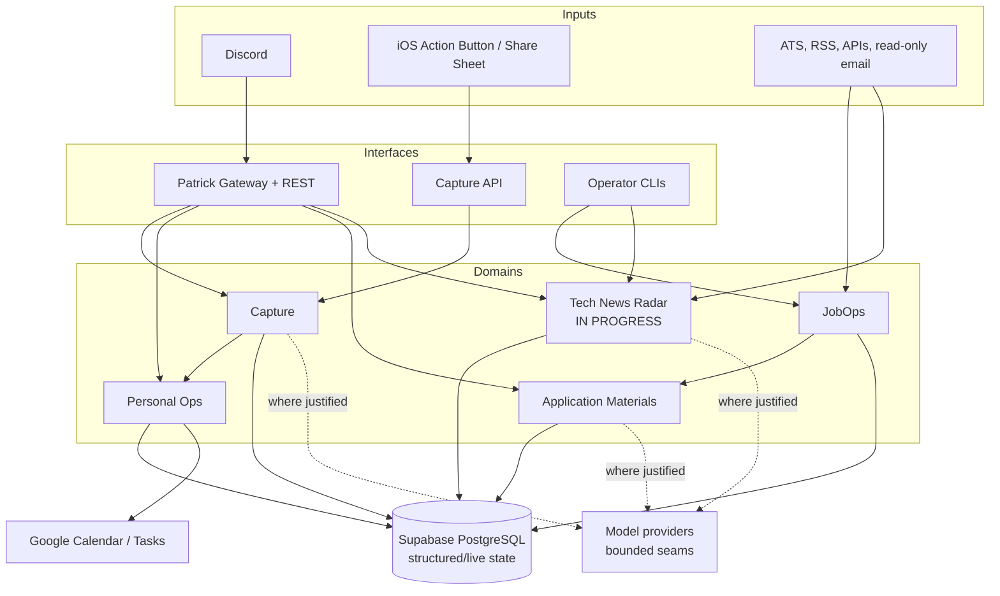
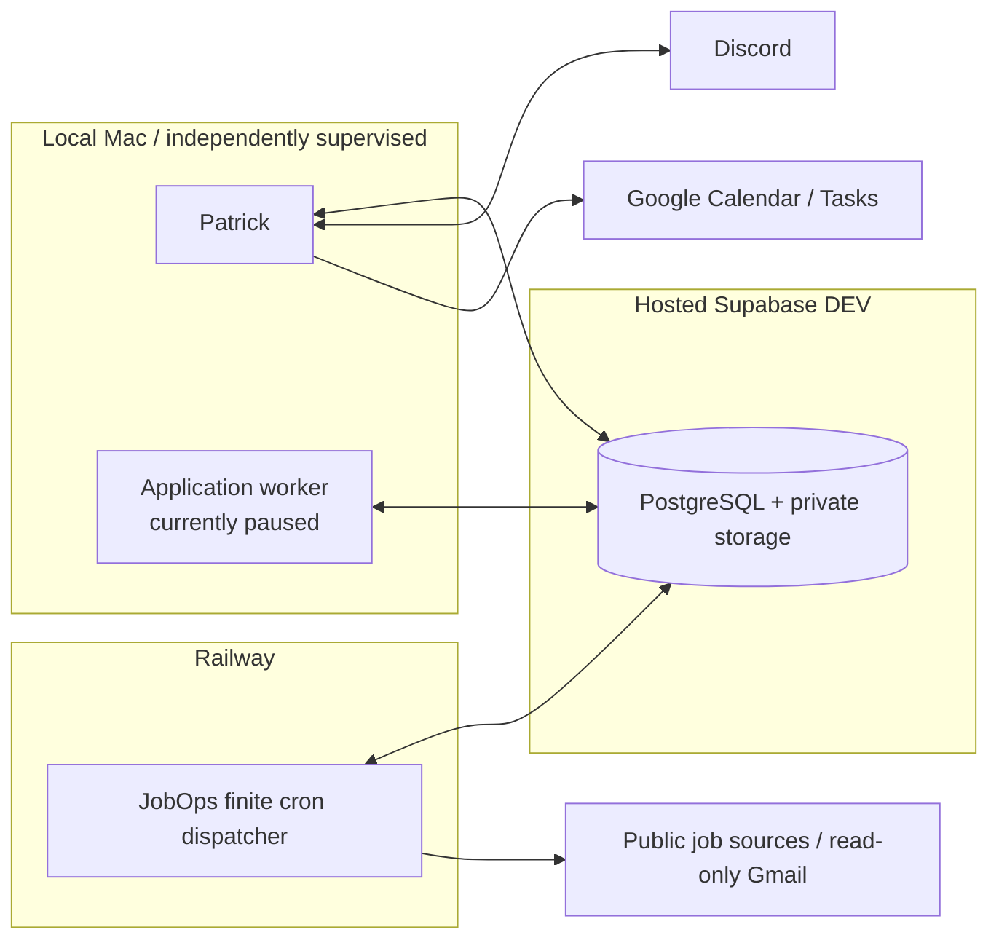

# Prateek OS — Study Guide

[Documentation home](README.md)

This guide explains the architecture shared by Prateek OS systems. The [Patrick Study Guide](patrick/study-guide.md) explains the cross-system interaction layer. Individual system guides then show how shared patterns are specialized for [JobOps](systems/jobops/study-guide.md), [Application Materials](systems/application-materials/study-guide.md), [Capture](systems/capture/study-guide.md), [Personal Ops](systems/personal-ops/study-guide.md), and the in-progress [Tech News Radar](systems/tech-news-radar/study-guide.md).

> Source baseline: reconciled 2026-09-05 from canonical `main` observed at `76edfe8635c5abf075c12e47eaa39b70f1b1bce5`. N1 was also inspected as a clean, committed feature-branch snapshot at `9693f07e4dd787173583e080d4a5beab7b576ce4`; it is not described as deployed or accepted.

## 1. Project philosophy

### A personal operating system, not a universal agent

The objective is a collection of cooperating tools that materially reduce friction in recurring personal work: finding jobs, preparing applications, capturing inputs, planning time, and eventually supporting editorial and knowledge workflows. Each domain service retains ownership of its own rules and state. Patrick gives those systems a common human-facing identity, but does not become a privileged super-agent.

This distinction prevents an attractive but dangerous architecture: a single model with broad credentials deciding what everything means and what to mutate. Prateek OS instead uses narrow adapters, typed domain contracts, database-enforced state transitions, and explicit approval boundaries.

### Deterministic first

The preferred order is:

1. stable provider IDs and database lookups;
2. normal code, timestamp arithmetic, parsers, rules, and statistics;
3. a model only for judgement that those tools cannot express reliably.

Job deduplication, eligibility, ranking, scheduling, task packing, replay, and approval checks are deterministic. Capture uses a model for natural-language interpretation, but code validates its structure and decides the final confidence band. Application Materials may use generation for writing, but verified evidence and deterministic PDF validators remain authoritative. N1's planned model role is cluster-level editorial judgement after cheaper filtering—not per-feed-item classification.

### Canonical and derived state

**Canonical state** is the durable fact the system must not silently rewrite: the original Capture, raw job observation, canonical task, approval decision, or source evidence. **Derived state** is a classification, ranking, summary, cluster, preference weight, or generated artifact that can be rebuilt.



Preserving both lets the system change its mind without changing history. A scoring algorithm can be versioned and rerun. A model interpretation can be superseded. The source input and timestamps remain available to explain why.

### Provenance and temporal truth

Provenance answers “where did this come from?” It includes stable source identity and distinct timestamps such as source creation, first observation, capture, import, and last observation. This matters because a document edited yesterday may contain a belief created years ago, and a job first seen today may have been posted last week.

### Private by default, approval by construction

Backend credentials never belong in clients. Public database roles receive no table access. Private artifacts stay behind backend-only boundaries. Consequential actions—Calendar writes, application submission, outreach, publication, deletion of canonical memory—require a human decision or remain forbidden.

“Approval required” is represented as durable state rather than a comment. A proposal can be `proposed`, `approved`, `rejected`, `expired`, `applied`, or `apply_failed`; only a valid transition permits the external mutation. This is stronger than relying on a caller to remember an `if` statement.

### Fail closed and preserve domain ownership

Missing authorization, ambiguous identity, stale approval, unknown location, malformed model output, absent configuration, or lost lease ownership yields no consequential action. The system records a bounded failure or safe `unknown` result and retains canonical evidence.

Shared packages supply small primitives. Domain repositories own domain tables. Discord code maps messages and reactions into domain calls; it does not reimplement Capture, JobOps, or Personal Ops rules.

## 2. Repository and monorepo structure

The implementation is a Node.js/TypeScript pnpm workspace.

```text
prateek-os/
├── apps/                 # process entry points and interface adapters
│   ├── discord-bot/      # Patrick's Discord Gateway/control surface
│   ├── capture-api/      # authenticated mobile/programmatic ingress
│   └── worker/           # local application-materials worker entry point
├── services/             # domain-owned behavior and persistence
│   ├── jobops/
│   ├── application-materials/
│   ├── capture/
│   ├── personal-ops/
│   └── news-radar/       # N1: local/in progress
├── packages/             # small shared contracts/utilities
│   ├── db/
│   ├── llm-router/
│   └── permissions/ ...
├── supabase/migrations/  # timestamped schema, function, and RLS history
├── supabase/tests/       # database/recovery proofs
├── ops/                  # local runtime management
├── docs/                 # current authority, ADRs, reviews, future notes
└── .github/workflows/    # CI
```

`pnpm-workspace.yaml` includes `apps/*`, `packages/*`, and `services/*`. A directory becomes an independently importable workspace package only when a real consumer needs it. This avoids speculative package boundaries while still allowing clear ownership.

## 3. Technology choices and tradeoffs

### TypeScript and Node.js

One language covers Discord, HTTP, provider adapters, CLIs, scheduling logic, and most tests. TypeScript makes domain states and provider seams explicit, while Node has mature Discord, HTTP, and tooling support. The repository does not record a formal language bake-off; the implemented architecture suggests the choice favored fast end-to-end delivery and shared types over adding a second runtime.

### pnpm monorepo

Workspaces give atomic cross-package changes, one lockfile, and root quality gates without forcing every subsystem into a separately released package. The tradeoff is broader CI and the need to respect package dependency ownership.

### Supabase PostgreSQL

PostgreSQL supplies relational integrity, transactions, indexes, constraints, functions, and row-level security. Supabase adds hosted Postgres, a generated HTTP API/client ecosystem, local development tooling, and managed authentication/storage capabilities. Prateek OS primarily uses it as structured live state; it is not treated as the eventual owner of every piece of durable personal memory.

### Discord

Discord already provides authenticated users, private channels, mobile/desktop clients, messages, slash commands, reactions, and buttons. That makes it a fast, useful control plane without building a dashboard. It is not canonical storage: message text is not re-parsed later to discover a job or approval identity when a durable mapping can be stored.

### Railway

Railway runs finite scheduled JobOps dispatcher processes. It reduces server maintenance while keeping the TypeScript process portable. The tradeoff is platform-specific deployment configuration and confusing terminology: a Railway environment named “production” can still be configured against the Supabase DEV database. Database identity, not the Railway label, defines the data environment.

### macOS LaunchAgents

Patrick and the optional Application Materials worker need persistent access to local/private capabilities. LaunchAgents provide per-user startup, restart, and independent supervision without keeping terminal windows open. The tradeoff is dependence on the Mac being logged in and awake; sleep pauses work, after which leases and replay rules must make recovery safe.

### GitHub Actions and the quality toolchain

CI uses the pinned Node/pnpm toolchain and runs formatting, ESLint, TypeScript checking, tests, and build. Vitest supports fast unit tests and gated integration suites. Prettier standardizes files mechanically; ESLint and the compiler catch different classes of errors.

### External and local components

External APIs are used only where they create real value: Discord, Google Calendar/Tasks, read-only Gmail job alerts, ATS/public feeds, and selected model providers. Local execution remains useful for private artifacts and tools unavailable or undesirable on a hosted worker. Provider calls are bounded, observable, and isolated behind adapters.

The recurring tradeoff is not “cloud versus local” in the abstract. It is implementation speed, operating cost, reliability, privacy, observability, and whether a workload needs a machine or credential that only exists locally.

## 4. PostgreSQL and Supabase from first principles

### Tables, keys, and time

A PostgreSQL table is a typed set of rows. A **primary key** uniquely identifies a row; Prateek OS generally uses UUIDs so identities can be created safely without a central integer allocator. A **foreign key** requires a referenced row to exist, preventing orphaned relationships. `timestamptz` stores an absolute instant; display code later renders that instant in a chosen time zone.

Indexes accelerate important access patterns and can enforce uniqueness. Constraints reject impossible states even if application code has a bug:

```sql
create table example_proposals (
  id uuid primary key,
  status text not null check (status in ('proposed', 'approved', 'rejected')),
  expires_at timestamptz not null,
  decided_at timestamptz,
  check ((status = 'proposed') = (decided_at is null))
);
```

### Transactions and RPC/functions

A transaction makes a group of writes atomic: all commit or none do. Capture uses this idea so a canonical row, idempotency ownership, attachments, interpretation, and actions cannot become a misleading half-save. JobOps similarly couples canonical job/observation/provenance writes.

PostgreSQL functions—often invoked through Supabase RPC—put concurrency-sensitive transitions beside the rows they protect. A sanitized claim function resembles:

    function claim_work(item_id, worker_id):
        update work_item
        set owner = worker_id,
            lease_token = random_token(),
            lease_expires_at = now() + lease_duration
        where id = item_id
          and (lease is absent or expired)
        returning item, lease_token

Completion must match both owner and unguessable token. A stale process cannot finish after another worker has reclaimed the item. This is **fencing**.

### RLS and backend-only access

Row-Level Security (RLS) makes database access policy part of PostgreSQL. Prateek OS migrations enable and force RLS, revoke access from public `anon`/`authenticated` roles, and expose privileged operations only to trusted backend service code. “Service role” is not permission for browser or Shortcut code to hold the key.

RLS is defense in depth. Application authorization still verifies the Discord user, channel, request token, and operation. Database restrictions protect against accidental broad queries or a misrouted public client.

### Migrations, not dashboard drift

A migration is an ordered, timestamped SQL change. It makes a schema reproducible locally, reviewable in Git, and promotable to another environment. Dashboard-only edits create invisible state that another developer or CI cannot reconstruct, so they are avoided. Applied shared migrations are immutable; later fixes are additive.

### Canonical state, idempotency, and durable concurrency

Idempotency means repeating one logical request converges on one result. A unique key such as `(actor_scope, idempotency_key)` or a stable source/external ID makes the database arbitrate concurrent duplicates. Fingerprints distinguish a legitimate replay from reuse of the same key with different content.

Leases solve “who may work this now?” Idempotency solves “has this logical thing already happened?” Fencing solves “may an old worker still finish?” Robust flows often need all three.

## 5. Railway and cron

**Cron** is a time-based trigger expressed as fields for minute, hour, day-of-month, month, and day-of-week. `*/5 * * * *` means “wake every five minutes.” A cron trigger should usually start finite work and exit; it is not itself a durable queue.

JobOps uses one Railway cron wake as a dispatcher:



Absolute slots are important. “Thirty minutes after the last attempt” drifts when a run is late. A target based on the calendar and a stable source hash resumes on the intended grid. Deterministic jitter spreads traffic without mutable random schedules. A process that misses several targets services the latest due target once rather than creating a catch-up storm.

Environment variables supply configuration and secret references at runtime. Their names may be documented; values must not be printed or committed. Railway starts a fresh process for each scheduled run, so database state—not process memory—owns leases, health, and delivery history.

## 6. Local persistent runtimes and launchd

A macOS LaunchAgent is a per-user service definition. `KeepAlive` can restart a process after failure; a wrapper script can establish the correct working directory, executable paths, and private environment before launching Node.

Prateek OS uses independent LaunchAgents for Patrick and, when installed, the Application Materials worker. Independent supervision prevents one workload's crash or long generation step from taking down Discord control. The management scripts and plist templates live under `ops/macos/application-materials/`.

Secrets belong in ignored files with restrictive permissions—commonly directory mode `0700` and file mode `0600`—or in an approved secret store. Wrappers should report only presence/readiness, never values.

Sleep suspends the processes. On wake, Gateway reconnection, expired leases, durable journals, and replay-safe queues allow recovery. Physical sleep/wake acceptance was necessary for Application Materials because ordinary unit tests cannot prove macOS actually supervises processes as expected.

## 7. Discord and Patrick

Patrick is the name shown to people. Authorization belongs to the actual actor and configured role, not the bot persona.

Discord offers two relevant interfaces:

- **REST** sends or edits resources such as notifications and reactions.
- **Gateway** is a persistent WebSocket event stream for messages, reactions, and interactions.

An **intent** declares which Gateway event families a bot needs. Message Content Intent is necessary to read Capture text, but the system avoids widening permissions without a working feature need.



Job messages store their Discord channel/message mapping before 📄 is seeded. Capture uses the Discord message ID as idempotency key. Buttons contain bounded identities that the backend revalidates; rendered prose never becomes the authority for which record is approved.

Slash command schemas have platform length limits. C2 real acceptance found a description that exceeded Discord's maximum, leading to a permanent regression test over the real command set.

## 8. Scheduling and recurring work

### Leases, heartbeats, and stale reclaim

A lease expires unless renewed. A heartbeat extends it only when the caller still owns it. If renewal fails, the process stops starting new work. A crashed process naturally stops heartbeating, allowing another worker to reclaim later.

### Retries, cooldowns, and isolation

Retries are bounded and classify transient versus terminal failures. Backoff slows repeated transient attempts. JobOps moves repeatedly failing sources into durable cooldown and sends one confirmed alert, then one recovery message when healthy. One source failure remains source-local; a shared lease/state failure can be fatal because it invalidates the whole run's authority.

### Idempotent delivery

External delivery and database acknowledgement cannot form one cross-system transaction. The chosen compromise is to persist pending intent, deliver, then atomically bind acknowledgement to the durable mapping. If the network succeeds and the acknowledgement fails, a rare orphan external message is possible; the canonical item stays pending rather than falsely claiming delivery. Per-destination state prevents a success in `#jobs-new` from acknowledging `#jobs-hot`.

See [JobOps](systems/jobops/study-guide.md) for the concrete recurring implementation.

## 9. Security and privacy

- Privileged Supabase keys stay in backend processes; no browser, Shortcut, or Discord payload contains them.
- DEV and PROD are separate databases. All currently accepted OS runtime behavior is against hosted DEV; PROD is not implied by a host's environment label.
- RLS and revoked public grants close tables by default.
- OAuth scopes are separated by purpose. Gmail ingestion uses read-only access to a dedicated label/account boundary. Calendar and Tasks have their own credential flow.
- Private credential files and exports use confined ignored directories, restrictive modes, traversal/symlink checks, and presence-only diagnostics.
- Capture attachment and URL fetching constrains schemes, hosts or resolved addresses, redirects, byte counts, file counts, and timeouts. These checks mitigate **SSRF**, where attacker-controlled input tricks a server into requesting internal/private network resources.
- Error text is sanitized and bounded before persistence or Discord delivery.
- Missing channel IDs, missing allow-lists, account mismatch, stale proposals, and unknown evidence fail closed.
- External mutations require approval. Application generation stops for human review; it never submits an application.
- Canonical records preserve their sources, allowing a decision or error to be audited later.

## 10. Model and prompt architecture

### Provider-neutral seams

`packages/llm-router` defines provider-neutral requests, structured results, typed failures, retry behavior, and usage. Gemini and OpenAI adapters translate at the edge. Capture owns Capture-specific prompt assembly and database recording; shared code does not import domain services.

### Deterministic authority around models



The model does not calculate trusted relative-time instants, choose database state transitions, or bypass Calendar approval. Schema-invalid or exhausted provider output becomes a safe result distinct from canonical-data failure.

### Prompt engineering without publishing private prompts

The documented pattern is:

    SYSTEM:
    Return one structured classification.
    Use only supplied evidence.
    Identify ambiguity instead of guessing.
    Do not invent dates or source claims.

    OUTPUT:
    {
      "classification": "...",
      "properties": { ... },
      "ambiguities": [ ... ],
      "confidence": 0.0
    }

Useful prompt construction separates responsibilities:

- code supplies a versioned allowed taxonomy and bounded evidence;
- the system instruction defines role, output contract, grounding, and ambiguity behavior;
- the user content contains the raw Capture or evidence bundle;
- schema validation rejects invented fields/types;
- deterministic post-processing resolves time, normalizes safe mechanics, checks grounding, and applies policy;
- retries are bounded and recorded;
- fallbacks preserve evidence and do nothing consequential.

Evaluation corpora include ambiguous commands, malformed output, missing fields, temporal language, proper nouns, multiple ideas, and safety-critical phrasing. Real provider bake-offs are separate from ordinary tests and record latency, accuracy, schema success, cost, and meaningful failure behavior. The selected model can differ by workload; N1 performed its own editorial bake-off rather than assuming Capture's choice was automatically best.

Full private production prompts, personal context, and hidden scoring rubrics are intentionally not reproduced here.

## 11. Deterministic scoring and ranking

The common pattern is:

1. extract inspectable features from canonical evidence;
2. normalize them into comparable bounded values;
3. apply hard eligibility or safety filters;
4. combine soft components into a versioned score;
5. map the result to thresholds/buckets;
6. apply stable ordering and tie-breakers;
7. store the derivation version so it can be rebuilt.

An intentionally sanitized formula is:

    score =
        location_component
      + relevance_component
      + experience_fit_component
      + freshness_component

Hard filters do not disappear into a low score. An unknown/foreign job location, for example, can suppress notification even if other components look strong. This makes “ineligible” distinguishable from “low priority.”

Canonical facts and ranking are separate. A source observation does not change because the ranking policy changes. Feature versions, profile versions, and freshness transitions identify when a cached result is reusable. Exact personal production profiles and private weights are omitted here even when an internal guide records them.

N1 uses two conceptual axes—global significance and owner/editorial relevance—so preference learning cannot bury major news and niche affinity does not pretend to be global importance.

## 12. Testing strategy

The repository policy is:

    contract
      → failing test (RED)
      → implementation
      → passing test (GREEN)
      → broader regressions

### Layers

- **Unit tests** attack pure parsing, classification, scores, time rules, validation, and state decisions.
- **Fakes** make provider, Discord, Google, filesystem, clock, and network behavior deterministic while preserving the real domain logic.
- **Integration tests** exercise real local PostgreSQL/Supabase migrations, constraints, RLS-sensitive functions, and transaction/concurrency behavior.
- **Fixtures** preserve representative external shapes after removing private data.
- **Concurrency/replay tests** deliberately run duplicate claims, stale owners, simultaneous first writers, duplicate approvals, and repeated delivery.
- **Regression tests** permanently encode defects found by review or real acceptance.
- **Owner acceptance** proves boundaries that automation cannot: real Discord command registration, mobile Shortcuts, OAuth accounts, Calendar mutation, hosted configuration, and physical sleep/wake.

### What tests try to break

- JobOps tests foreign/ambiguous locations, provider identity collisions, Gmail label/account isolation, MIME bombs, pagination overlap, stale rankings, partial Discord delivery, scheduler DST/lease loss, and source-local failures.
- Application Materials tests invented facts, changed metrics, traversal, malformed model output, budget exhaustion, process death between reservation/checkpoint, JSONB key reordering, LaTeX timeout/child cleanup, corrupt PDFs, and redelivery without regeneration.
- Capture tests duplicate Discord delivery, same-key/different-payload races, atomic attachment persistence, SSRF/DNS rebinding, malformed structured output, ambiguous imperatives, unresolved backreferences, confirmation races, temporal/DST cases, and replay without reinterpretation.
- Personal Ops tests hard Calendar constraints, deadline boundaries, over-capacity honesty, stale proposals, rejection with zero mutation, duplicate approval, ownership tags, mirror deletion, token expiry/401 refresh, and concurrent OAuth refresh.
- N1 tests URL identity, cluster overmerge/undermerge, live-feed parser bounds, source failure isolation, DST-safe digest slots, feedback replay, cost caps, grounded model output, pipeline selection races, reset-versus-release fencing, and release fallback without evidence loss.

### Historical lessons made permanent

Real acceptance found defects that isolated unit tests did not: a `/task` surface could not populate scheduling fields; planner `due_at` was advisory on one path; a Discord command description was too long; OAuth access tokens were cached beyond expiry; and an iOS Share Sheet needed content separated from commentary. Independent reviews found concurrency or provenance bugs such as orphan story clusters on repeat ingest, unsafe stale ownership, and model telemetry gaps. Each became a focused regression rather than a one-time patch.

Exact-SHA acceptance matters because “tests passed” is useful only if reviewers, CI, and hosted/manual proof all refer to the same code.

## 13. CI/CD

**Continuous integration (CI)** automatically checks a revision. The workflow installs the pinned dependency graph, then verifies formatting, lint, TypeScript types, tests, and build. A local pass is evidence about a working tree; an exact-SHA hosted CI pass is reproducible evidence about the revision proposed for acceptance.

CI is not deployment. A green build does not authorize a hosted migration, restart Patrick, register Discord commands, call a paid API, or touch PROD. Those mutations occur only after the relevant review and explicit gate. Post-merge CI then confirms that the canonical branch still represents the accepted artifact.

## 14. Git and milestone workflow

At a public-safe level, the lifecycle is:



ADRs record lasting decisions. Permanent milestone IDs such as `J2`, `C3`, and `N1` do not change when dates move. Review directories preserve implementation, failed reviews, corrections, acceptance, final gate, and post-merge evidence rather than rewriting history into a smooth story.

The stable active context/timeline are current authority; archived milestone snapshots explain history only. This preserves the fact that earlier JobOps and Application Materials work was built through a Codex-oriented workflow, while later milestones use Claude-oriented orchestration and independent Claude review. Public documentation should not rewrite that provenance.

## 15. Cost-conscious architecture

The system prefers free or low-cost primitives when they remain useful: public feeds, deterministic preprocessing, bounded database work, and existing hosting. Models are invoked only after cheap filters and with request/attempt caps. Usage records store provider/model, latency, tokens, and estimated cost when the provider truthfully supplies them—unknown values remain unknown.

Paid APIs are justified by measured benefit, not the presence of an “AI” feature. A bake-off compares quality, schema reliability, latency, safety, and price. N1's local records project model cost comfortably inside its small monthly target, but this remains an in-progress estimate, not proof of hosted operating cost. Brave Search is designed as a capped gap-discovery signal that skips work when its budget is exhausted.

## 16. Whole-system diagrams

### Architecture



### Runtime and deployment map



## 17. Glossary

| Term            | Meaning                                                                                               |
| --------------- | ----------------------------------------------------------------------------------------------------- |
| Canonical       | The authoritative durable record that derived processing must not silently replace.                   |
| Derived         | Rebuildable output such as a score, interpretation, summary, cluster, or generated artifact.          |
| Provenance      | Recorded origin, timestamps, identity, and lineage explaining where a record came from.               |
| RLS             | PostgreSQL Row-Level Security: database-enforced access rules applied to rows.                        |
| RPC             | A callable database function or remote procedure used for an atomic operation.                        |
| Lease           | A time-limited exclusive claim on work.                                                               |
| Fencing         | Rejecting completion by a worker that no longer owns the current lease/token.                         |
| Idempotency     | Repeating one logical request converges on the same outcome instead of duplicating it.                |
| Replay          | Re-running stored work from its persisted parameters, without reinterpreting the original request.    |
| Cron            | A calendar-based scheduler expression that starts recurring finite runs.                              |
| OAuth           | Delegated authorization that grants a bounded external-service scope without sharing a password.      |
| PKCE            | An OAuth protection that binds an authorization response to the client that initiated it.             |
| Gateway         | Discord's persistent WebSocket event connection.                                                      |
| Intent          | A declared Discord Gateway event category the bot is allowed to receive.                              |
| Adapter         | Boundary code translating an external provider/interface into domain types.                           |
| Domain service  | Code that owns one subsystem's behavior and state transitions.                                        |
| Migration       | An ordered, version-controlled database schema/security change.                                       |
| Confidence band | A deterministic high/medium/low policy result governing automatic action, confirmation, or no action. |
| Working tree    | Files currently checked out, including uncommitted edits; not equivalent to accepted Git history.     |
| CI              | Automated build/test checks against a particular revision.                                            |
| SSRF            | Server-Side Request Forgery: untrusted URLs causing a server to reach forbidden internal resources.   |
| Observation     | One source-specific sighting of a canonical item.                                                     |
| Outbox          | A durable list of side effects to perform after canonical state is saved.                             |

## Source map

Important implementation-repository paths:

- `AGENTS.md`, `CLAUDE.md`
- `docs/source/active/context.md`, `docs/source/active/timeline.md`
- `docs/ARCHITECTURE.md`, `docs/MODEL_POLICY.md`
- `docs/operations/system-building-blueprint.md`
- `docs/adr/0006-patrick-interaction-identity.md`
- `docs/adr/0008-milestone-identifiers-scheduling-archives.md`
- `package.json`, `pnpm-workspace.yaml`, `tsconfig.json`, `vitest.config.ts`, `eslint.config.mjs`
- `.github/workflows/ci.yml`
- `supabase/migrations/`
- `ops/macos/application-materials/`
