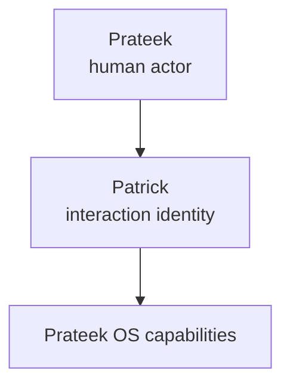
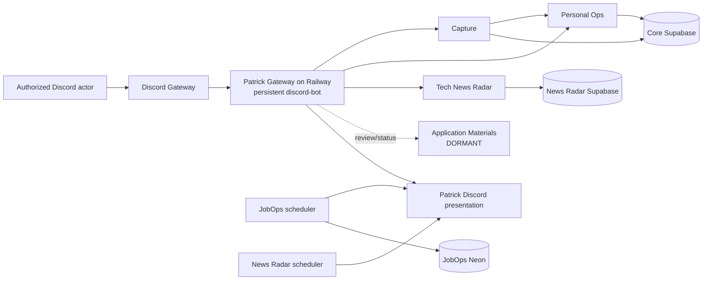
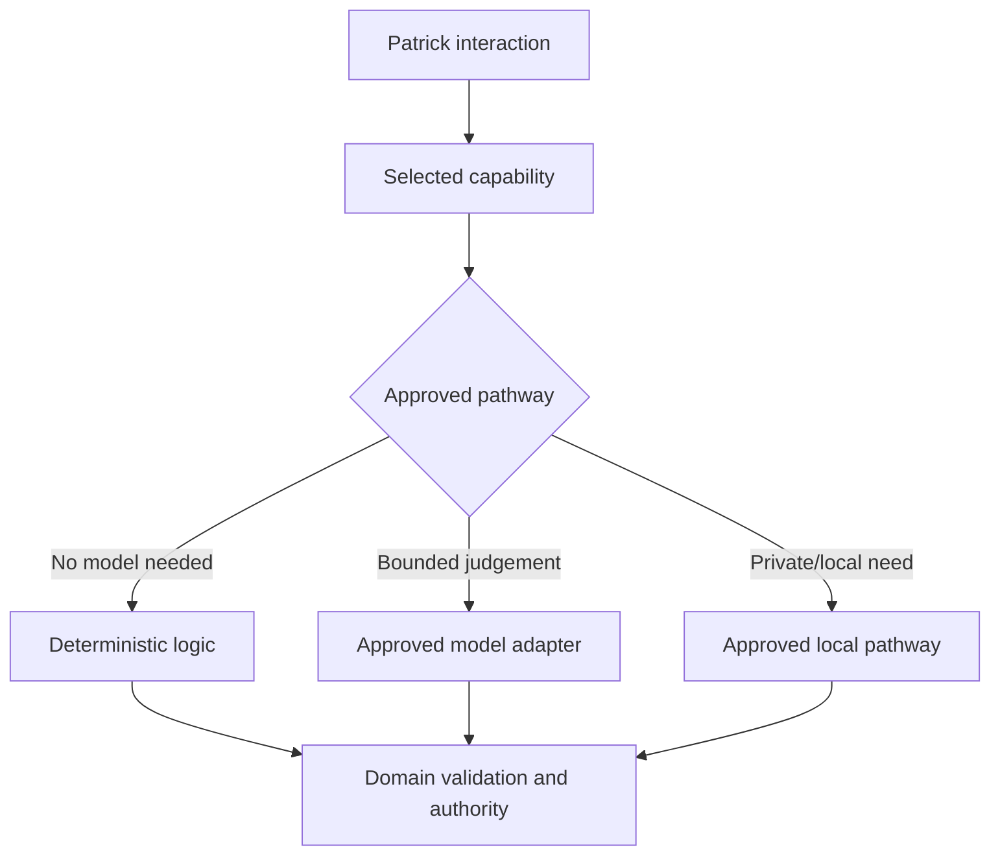
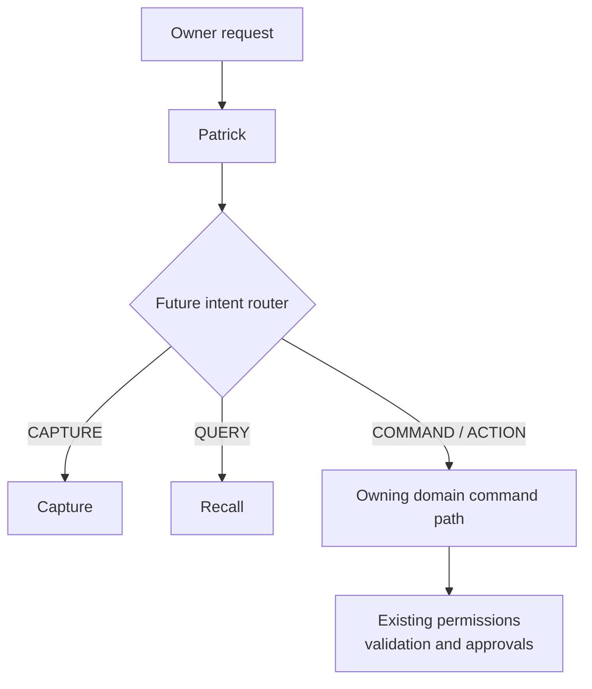
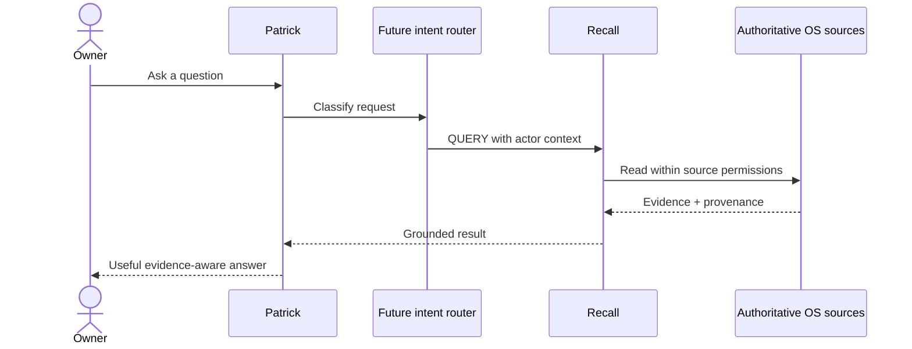
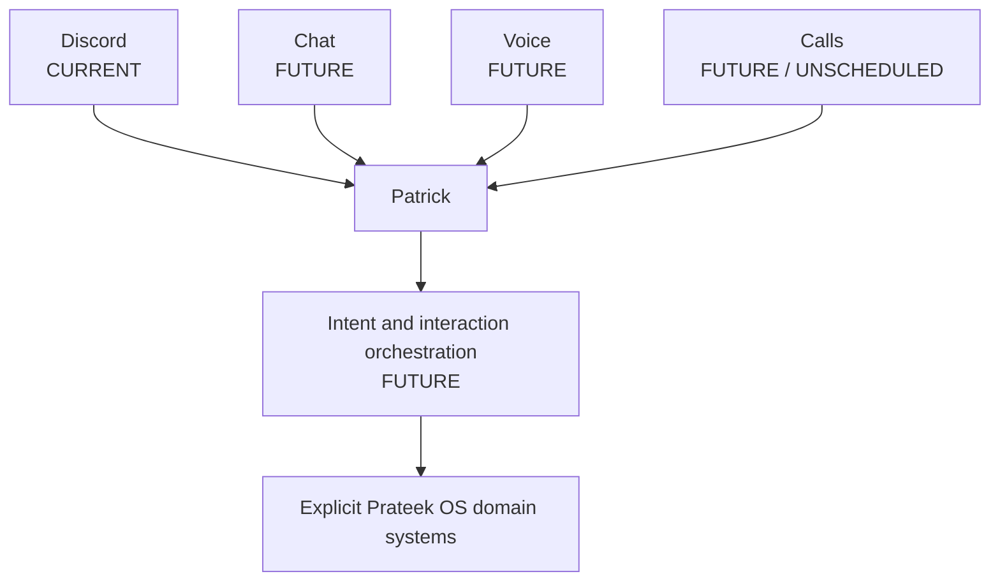

# Patrick — Study Guide

> **Last updated:** 2026-09-19<br>
> **Source repository:** `prateek-os`<br>
> **Source baseline:** accepted cleanup HEAD `d67e5cf543e62636a6dfa0ee96d35835028e1e9d` (derived from canonical `main` `e82862bbbaee4cc7a847897b49ad05c23ceab387`)<br>
> **Source scope:** `apps/discord-bot/`; `services/{capture,personal-ops,jobops,application-materials,news-radar}/`; `docs/adr/0006-patrick-interaction-identity.md`; `docs/adr/0019-n1-centralized-patrick-runtime-and-replay-readiness.md`; Recall/Patrick files in `docs/future/`; and `docs/reviews/news-radar/N1/`<br>
> **Documentation status:** Mixed current/future

[Patrick overview](README.md) · [User guide](user-guide.md) · [Product vision](vision.md) · [OS study guide](../os-study-guide.md)

> **Status boundary:** Sections marked **CURRENT** describe accepted behavior. Sections marked **FUTURE ARCHITECTURE** describe product direction or planned concepts, not deployed capability. Tech News Radar (N1) is complete, formally closed, and merged to canonical `main` on 2026-09-13 (`1b6e746`/`586d736`). Patrick Gateway runs persistently on Railway (`patrick-gateway`) under distributed lease coordination.

## 1. Identity is not platform or authority

The naming model separates four ideas that are easy to blur:

| Name           | Meaning                                                           |
| -------------- | ----------------------------------------------------------------- |
| **Prateek**    | Human owner, administrator, and actor.                            |
| **Prateek OS** | Platform/system composed of explicit capabilities and contracts.  |
| **Patrick**    | Canonical human-facing interaction identity/layer for Prateek OS. |
| **Pat**        | Informal conversational alias; not a separate technical identity. |

Patrick is not the whole OS, a domain subsystem, canonical storage, an authorization principal, an LLM, the future Brain, or one giant agent service. The simple product-level relationship is:



The real architecture under `OS` remains divided into services with explicit ownership. Naming a common interaction layer creates UX coherence without transferring authority or data ownership into that layer.

## 2. Why interaction is a separate architectural concept

A domain system answers “who owns this fact or operation?” Capture owns captured inputs and their interpretation lifecycle. Personal Ops owns canonical tasks and schedule proposals. JobOps owns job observations, eligibility, ranking, and delivery state. Application Materials owns preparation requests and artifacts. Tech News Radar owns its future news evidence and editorial state. Patrick answers a different question: “how does a person encounter and communicate with these capabilities?”

Separating those concerns provides three benefits:

1. A new surface can reuse domain contracts instead of reimplementing the OS.
2. A friendly persona cannot silently become a source of truth or permission.
3. Domain tests, validation, failure states, and approval gates remain independently enforceable.

The intended experience can be unified even while implementation remains modular.

## 3. CURRENT — Discord-first implementation

Patrick's first concrete surface is the existing Discord bot in `apps/discord-bot`. The bot authenticates, connects through the Discord Gateway, and uses the `Guilds`, `GuildMessages`, `GuildMessageReactions`, and privileged `MessageContent` intents. It registers slash commands and handles message, interaction, and reaction events. Configuration is fail-closed: an absent system channel or integration disables that bounded surface rather than treating every channel as eligible.

The visible Discord username “Patrick” was set at the Discord account level. The Discord application/project, repository, packages, and services remain named Prateek OS. The bot logs the account identity supplied by Discord; repository code does not perform the username rename.

There is no standalone Patrick service. The shared bot runtime composes adapters and domain services:



### Current event surfaces

| Discord input/output             | Explicit current route                                                                                    |
| -------------------------------- | --------------------------------------------------------------------------------------------------------- |
| Message in Capture channel       | Authorized message handler → Capture service → deterministic or bounded natural-language interpretation.  |
| `/task`, `/today`, `/week`       | Personal Ops handlers create or read canonical task state.                                                |
| `/plan`                          | Personal Ops creates a point-in-time schedule proposal; a button decision gates Calendar application.     |
| Confirmation buttons             | Persisted Capture confirmation lifecycle; approval may release a bounded action, rejection performs none. |
| Calendar proposal buttons        | Persisted proposal decision and fenced apply path; the interface does not write Calendar directly.        |
| Job notifications                | JobOps produces explainable, persisted Discord delivery through its own notification path.                |
| 📄 on a job notification         | Stored Discord identity resolves a canonical job and queues one idempotent Application Materials request. |
| `/prepare`                       | Authorized Application Materials fallback/redelivery surface; worker is currently dormant.                |
| `#tech-firehose` / `#tech-radar` | Tech News Radar delivers validated/deduped feeds and curated radar stories.                               |
| ✅ / ❌ reactions                | Replay-safe preference feedback on Tech News Radar stories.                                               |
| 🎬 / 🧵 reactions                | Editorial Story Pipeline selection (primary / secondary active).                                          |
| `/news-pipeline`                 | Manage, inspect, stash, trim, reset, or release editorial outlines to `#tech-desk`.                       |
| `/news-source`, `/news-flag`     | Inspect/toggle catalog sources; mark stories as important or covered.                                     |

### Explicit routing, not general intent routing

Routing today is structural. A message is handled because it appears in the configured Capture channel. A slash command selects a named handler. Buttons carry bounded custom identifiers. Reactions are recognized only on eligible messages/channels and then resolved through durable mappings. Patrick does not first infer a system-wide `CAPTURE`, `QUERY`, or `COMMAND` intent.

Natural-language interpretation currently exists **inside Capture**. It proposes Capture-specific classifications and fields; deterministic schema, confidence, temporal, executor, and approval logic remain authoritative. It is not a Patrick-wide conversational router.

## 4. CURRENT — Actor, interface, and authorization

Patrick is the interface, not the authority. The conceptual request context is:

```text
actor identity + role/permissions + interface = evaluated request
```

Examples include `Prateek / admin / Patrick`, `authorized user / bounded role / Patrick`, and, for a future call surface, `unknown caller / untrusted / Patrick Call Interface`. Patrick itself receives no admin role and cannot turn an untrusted actor into a trusted one.

Current Discord handlers compare the Discord actor with configured authorized identities before protected actions. Channel eligibility is checked separately. Domain rules then apply after interface-level admission:

- Capture rejects or ignores unauthorized/wrong-channel input before normal persistence.
- Calendar mutation remains proposal- and approval-gated.
- Application Materials requests remain authorized, idempotent, private, and human-review-bound; no application is submitted.
- JobOps never converts a reaction into an application or outreach action.
- Domain state, not Discord prose, is authoritative for identity and transitions.

A more natural interface must preserve or strengthen these controls. Conversational fluency is not authorization.

## 5. CURRENT — Domain and model boundaries

Patrick should not be equated with the model used by one capability. Current systems already demonstrate different choices:

- JobOps runtime ranking and eligibility are deterministic and use no LLM.
- Capture may use bounded model interpretation, while code validates the result and decides confidence/action behavior.
- Application Materials may use generation, grounded evidence, and deterministic document validation; its runtime is currently paused.
- Personal Ops planning and proposal application are deterministic.
- Tech News Radar's hosted-DEV, unaccepted design contains optional grounded model assistance with deterministic fallback.

Conceptually:



A future provider router may improve provider/profile selection, accounting, and consistency. It must not collapse the OS into one opaque prompt or expose private production prompts.

## 6. CURRENT — Limitations and failure behavior

Patrick today does not provide open-ended chat, general question answering, cross-system intent routing, Recall, Brain context, conversational voice, telephone interaction, or cross-surface continuity. Capture can receive an iOS voice Shortcut, but that is a bounded Capture ingress rather than a conversational Patrick voice surface. “Pat” is a documented alias, not implemented wake-word/name resolution.

Failures remain bounded to the relevant layer:

- invalid actor or channel → ignore/reject without granting access;
- malformed or unsafe Capture input → reject without unsafe partial ingestion;
- model unavailable/low confidence → preserve raw Capture and avoid an unjustified action;
- ambiguous interpretation → confirmation or safe unknown state;
- stale/duplicate proposal → refuse duplicate or stale mutation;
- external provider failure → retain canonical domain state and expose bounded status;
- Discord delivery failure → do not reinterpret missing presentation as missing domain truth;
- one optional integration unavailable → keep unrelated Patrick surfaces running where their configuration permits.

This is why canonical identifiers and lifecycle state live below Discord. A reaction, message, or button is an input or presentation artifact, not the durable truth.

## 7. FUTURE ARCHITECTURE — Intent routing

A mature Patrick may decide broadly **where** a request belongs before a domain pipeline starts. The target domain still decides **how** it is executed.



Illustrative future routes:

- “I should make a video about local AI” → `CAPTURE` → Capture.
- “When is my next free afternoon?” → `QUERY` → Recall → authoritative evidence.
- “Schedule two hours for N1 testing tomorrow” → `COMMAND` → Personal Ops/Calendar proposal path.

The router is future and unscheduled. It is classification and dispatch, never authority. Ambiguity should fail toward a non-consequential path, and command routing must reuse the target system's existing approval boundary rather than invent a shortcut.

## 8. FUTURE ARCHITECTURE — Patrick and Recall

Recall is a scheduled but unimplemented provenance-preserving read/query/orchestration system. Patrick is the conversational layer; Recall is the read side.



Recall must not silently create truth, duplicate canonical ownership, or gain write authority merely because it can read. Patrick must not become the database/query engine. Exact query interfaces, sources, ranking, caching, and federation remain for RC1 scoping.

## 9. FUTURE ARCHITECTURE — Patrick and Brain

**Current fact:** Patrick does not consume [Prateek Brain](../../prateek-brain-docs/README.md) in any form.

**Future possibility:** explicit Prateek OS ↔ Brain integration may give Patrick access to authorized context, potentially through Recall or another approved contract. The Brain remains a separate authority and its security model remains binding:

- intrinsic source classification (`BLOCKED`, `LOCAL_RESTRICTED`, `LOCAL_ONLY`, or `CLOUD_ALLOWED`);
- read/access policy (`AUTOMATIC`, `EXPLICIT`, `APPROVAL_REQUIRED`, or `DENY`);
- runtime capability grants such as `READ_GRANT` and `EGRESS_GRANT`;
- provenance and the source's intrinsic ceiling;
- effective `DENY` boundaries that grants cannot override.

Patrick is not an authorization principal, cannot grant itself access, cannot turn `LOCAL_ONLY` evidence into cloud-egressable evidence, and cannot bypass an effective `DENY`. Public documentation intentionally contains no private Brain sources or contents.

## 10. FUTURE ARCHITECTURE — Multi-surface evolution

The surface may change; the underlying OS should not be rebuilt per surface.



Surface adapters should normalize actor identity, role, channel/session provenance, input modality, and response capabilities. They should invoke shared domain contracts. Canonical state must live in those underlying systems, not in a transient chat or voice session, if later continuity is to be trustworthy.

## 11. One assistant, not one giant service

Patrick should eventually feel coherent across Capture, Recall, JobOps, Personal Ops, Tech News Radar, Application Materials, creator systems, and authorized Brain integration. That does not justify a monolith with universal credentials.

Each domain should retain:

- canonical data and provenance;
- authorization and privacy boundaries;
- validation and deterministic contracts;
- explicit failure and recovery behavior;
- approval policies and consequential-action fences;
- independently testable adapters.

Patrick can standardize conversational conventions, response presentation, identity continuity, and high-level routing while remaining unable to manufacture authority. This design limits blast radius, supports provider/surface independence, and lets a failed capability degrade honestly without taking every interaction offline.

## 12. Testing and security implications

Current Patrick tests should prove event routing, actor/channel rejection, command-schema validity, idempotent reaction/button behavior, durable mapping, bounded message rendering, and safe behavior when optional integrations are absent. Domain suites must still prove their own database constraints, permissions, leases, proposal freshness, duplicate fencing, validation, and provider failure behavior.

Future multi-surface work adds contract tests that run the same synthetic intent through different adapters and verify equivalent actor context and domain calls. Intent-router evaluation should include ambiguous capture/query/command phrasing, adversarial attempts to obtain authority through conversation, and strict no-mutation tests for query paths. Recall answers require provenance and staleness tests. Brain federation requires explicit classification/read/grant/egress/DENY matrices. Cross-surface continuity tests must prove that state comes from authoritative systems rather than hidden session memory.

Security reviews should assume every natural-language input is untrusted, every model output is advisory, and every new surface changes identity and disclosure risks. Logs and public fixtures must exclude credentials, private messages, private Calendar/task/Capture content, private Brain evidence, production prompts, and sensitive personal data.

## 13. Source authority

This guide is grounded in the active architecture/user/roadmap documents, Patrick identity ADR, Recall ADR, future intent-router/call/Brain/model-routing notes, committed Discord adapters, and the reconciled public domain guides. See each [system guide](../systems/README.md) for the detailed contracts Patrick invokes.
