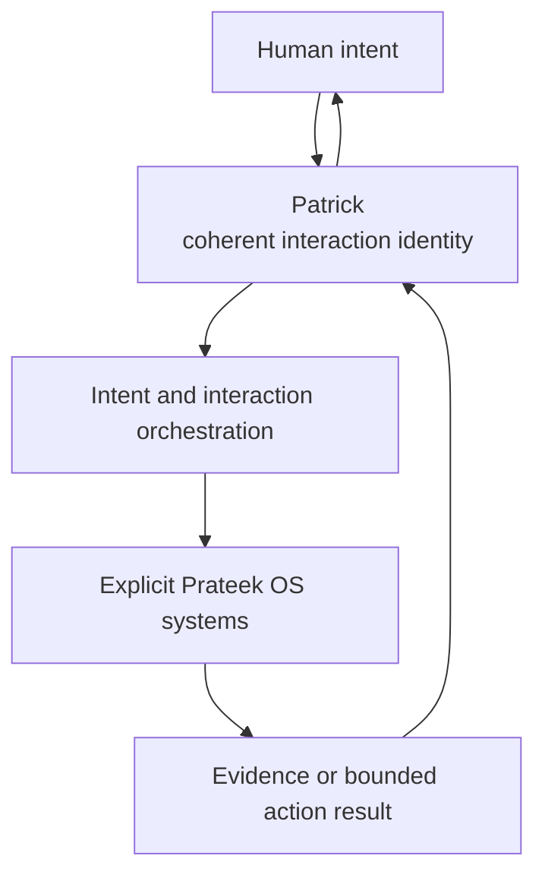
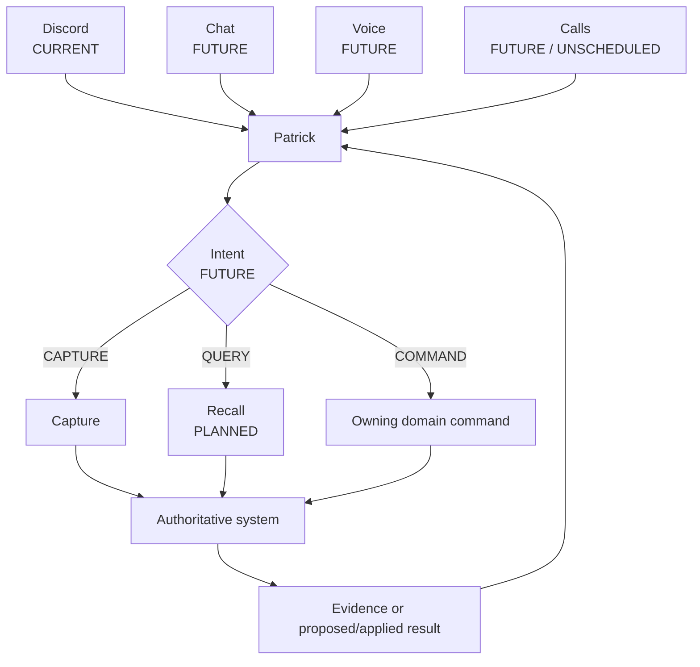

# Patrick — Product Vision

> **Last updated:** 2026-09-19<br>
> **Source repository:** `prateek-os`<br>
> **Source baseline:** accepted cleanup HEAD `d67e5cf543e62636a6dfa0ee96d35835028e1e9d` (derived from canonical `main` `e82862bbbaee4cc7a847897b49ad05c23ceab387`)<br>
> **Source scope:** `docs/adr/0006-patrick-interaction-identity.md`; Patrick/Recall/call/Brain/model-routing files in `docs/future/`; `docs/{ROADMAP,PRIVACY,MODEL_POLICY}.md`; `apps/discord-bot/`; and `docs/reviews/news-radar/N1/`<br>
> **Documentation status:** Vision

[Patrick overview](README.md) · [Technical study guide](study-guide.md) · [Current user guide](user-guide.md)

> **FUTURE PRODUCT / ARCHITECTURAL VISION:** Except for the Discord-first baseline explicitly identified below, this document describes direction, not current implementation, scheduling, or authorization to build. No stage carries a date unless separately established by the authoritative roadmap.

## North Star

Patrick should grow from Prateek OS's Discord identity into its coherent human-facing interaction layer: a persistent, recognizable assistant through which the owner can capture, ask, organize, review, and initiate bounded actions across the operating system.

“Jarvis-like” is the useful product analogy. The aspiration is the role Jarvis plays as a consistent interaction layer above many capabilities—not literal fictional capability. Patrick should make a modular operating system feel approachable and continuous without pretending the OS is omniscient or turning it into an unbounded agent.



## What “Jarvis-like” means here

### It does mean

- one recognizable identity across appropriate interaction surfaces;
- natural, low-friction conversation;
- access to many underlying OS capabilities through explicit contracts;
- context-aware routing to the system that owns the request;
- continuity when moving between surfaces;
- evidence-aware answers and clear action proposals;
- appropriate proactive assistance produced by bounded underlying systems.

### It does not mean

- AGI, consciousness, or fictional omniscience;
- unrestricted autonomy or silent consequential action;
- bypassing actor identity, permission, approval, or privacy controls;
- universal database or Brain access;
- equating Patrick with one LLM, provider, or prompt;
- one giant monolithic agent service with universal credentials;
- confident invention when authoritative evidence is missing.

## Evolution

These stages describe conceptual maturity, not committed dates or a promise that every surface will ship.

### Stage 1 — Discord-first Patrick (CURRENT)

Patrick is the account-level Discord presentation identity for existing Prateek OS interaction. Explicit handlers connect messages, commands, buttons, reactions, and notifications to Capture, Personal Ops, JobOps, and Application Materials. Tech News Radar/N1 has additionally been activated on hosted DEV; its correction passed delta review and hosted reverification, while owner acceptance, merge, and closeout remain pending. There is no general intent router, Recall, Brain integration, or cross-surface continuity.

### Stage 2 — Richer natural interaction and routing (FUTURE)

Natural interaction expands beyond Capture-specific interpretation. A bounded intent router first distinguishes broad classes such as `CAPTURE`, `QUERY`, and `COMMAND / ACTION`, then dispatches to explicit system contracts. Initial scope should be narrow and evaluated against real owner needs rather than claiming arbitrary conversation support.

### Stage 3 — Recall and a coherent read side (PLANNED, NOT IMPLEMENTED)

Recall becomes the provenance-preserving query/orchestration system over authoritative OS data. Patrick presents the question and answer; Recall retrieves and composes evidence. Recall does not silently create truth, become canonical storage, or gain mutation authority.

### Stage 4 — Multiple surfaces (FUTURE)

Patrick may become available through conversational chat, voice, telephone/call interaction, and other appropriate mediums. Discord remains one adapter, not a special reimplementation of domain logic. The call interface is future and unscheduled; its identity, disclosure, recording, legal, and caller-trust requirements require dedicated design and validation.

### Stage 5 — Authorized cross-system context and selective Brain federation (FUTURE)

Patrick may obtain richer context through explicit system contracts and a future Prateek OS ↔ Brain integration. Brain evidence remains governed by intrinsic source classification, read/access policy, `READ_GRANT`, `EGRESS_GRANT`, provenance, and effective `DENY` boundaries. Patrick cannot grant itself access and is never the authorization principal.

### Stage 6 — Mature proactive/contextual interaction (FUTURE)

Patrick may surface important JobOps changes, urgent Tech News Radar items, reminders/resurfacing, proactive intelligence, or contextual suggestions as systems explicitly designed for those purposes mature. Proactivity should be bounded, explainable, relevant, permission-aware, and non-spammy—not a general autonomous-agent claim.

## Interaction architecture

The surface changes; domain authority does not.



Patrick decides where a request belongs. The selected capability decides how to perform it through its approved deterministic and/or model pathway.

Illustrative future interactions:

```text
“I should make a video about local AI”
  → Patrick → CAPTURE → Capture

“When is my next free afternoon?”
  → Patrick → QUERY → Recall → authoritative Calendar/OS evidence

“Schedule two hours for N1 testing tomorrow”
  → Patrick → COMMAND → Personal Ops → Calendar proposal → owner decision
```

Routing a sentence to `COMMAND` does not approve it. Personal Ops retains Calendar authority and its proposal fence. Similar rules apply to every consequential domain.

## One assistant, not one giant service

A coherent identity can sit over Capture, Recall, JobOps, Personal Ops, Tech News Radar, Application Materials, creator systems, and authorized Brain integration while each retains:

- canonical data and provenance;
- security and actor permissions;
- validation and deterministic contracts;
- bounded model use, if any;
- explicit failure/recovery modes;
- approval policies.

This composition creates one assistant experience without an agent holding universal credentials or inventing cross-domain truth. A capability can be unavailable while Patrick still explains the boundary and keeps other surfaces useful. A provider can change without changing Patrick's identity. A new surface can reuse domain contracts instead of copying system logic.

## Memory and context

Patrick should not itself be the memory store. Chat-session history is transient, surface-specific, incomplete, and difficult to govern as canonical truth. Durable state belongs in the system that owns it: Capture records in Capture, tasks and proposals in Personal Ops, job evidence in JobOps, query evidence in source systems, and Brain memory in the Brain under its own controls.

Patrick may carry bounded conversational context for usability, but it should resolve durable facts through authoritative systems. Responses should distinguish evidence, derived interpretation, uncertainty, and unavailable context. This makes correction and provenance possible and prevents a fluent response from silently rewriting history.

## Cross-surface continuity

The long-term experience should remain recognizably Patrick even when the medium changes. A future interaction might be:

1. tell Patrick something by voice;
2. inspect the resulting canonical Capture later in Discord/chat;
3. ask a related question;
4. receive provenance-bearing evidence through Recall;
5. approve a proposed action;
6. have the correct deterministic subsystem execute it.

This continuity does **not** exist today. It depends on stable actor identity, explicit session/surface provenance, shared domain contracts, and canonical state below the conversation layer. Continuity cannot safely come from one long hidden transcript or one model's context window.

## Models and provider independence

Patrick is an interaction identity above implementation choices. One request may need no model; another may use deterministic parsing, a cheap hosted model, a stronger bounded model, a local model, or future approved provider routing. The target capability should select and account for that pathway according to its contract.

A future Patrick-wide router could improve consistency and provider selection, but it should preserve model-run accounting, checkpoints, structured validation, recovery, privacy, and domain authority. It must not become one opaque model call that interprets, authorizes, executes, and narrates everything.

## Safety and trust

Greater conversational power should strengthen—not weaken—existing controls.

```text
actor identity
  + role and permissions
  + Patrick surface
  + target-domain policy
  = allowed interaction
```

Prateek may interact as an admin through Patrick. Another authorized user may have a bounded role through the same identity. An unknown caller may reach a future Patrick Call Interface and still remain untrusted. Patrick neither inherits the actor's role nor supplies a missing one.

Safety requirements include:

- authenticate and resolve the actor separately from the interface identity;
- preserve proposal/approval gates for consequential actions;
- show provenance and uncertainty for answers;
- fail closed on ambiguity, stale authority, or missing permission;
- prevent model output from becoming direct mutation authority;
- respect Brain source/read/grant/egress/DENY controls;
- minimize private context and prevent unintended egress;
- keep proactive delivery explainable, relevant, and bounded;
- degrade gracefully when a domain, provider, or surface is unavailable.

## Design principles

1. **One assistant experience, many explicit systems.** Coherence belongs in interaction; authority stays with domains.
2. **Natural interaction over deterministic authority.** Conversation can express intent, but validated contracts decide outcomes.
3. **Context without hidden authority.** More context never grants broader permissions.
4. **Provenance over confident invention.** Answers point back to evidence and admit uncertainty.
5. **Graceful failure.** One unavailable capability should produce an honest boundary, not fabricated success or total collapse.
6. **Privacy before convenience.** Sensitive context is accessed and exposed only under explicit policy.
7. **Usefulness without notification overload.** Proactive behavior is rare enough to remain valuable.
8. **Provider independence where practical.** Patrick's identity and domain contracts do not depend on one model vendor.
9. **Surface independence where practical.** Discord, chat, voice, and calls reuse capabilities instead of forking them.
10. **No authority by personality.** A friendly, familiar interface remains subject to the same—or stronger—controls as any API.
