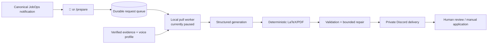
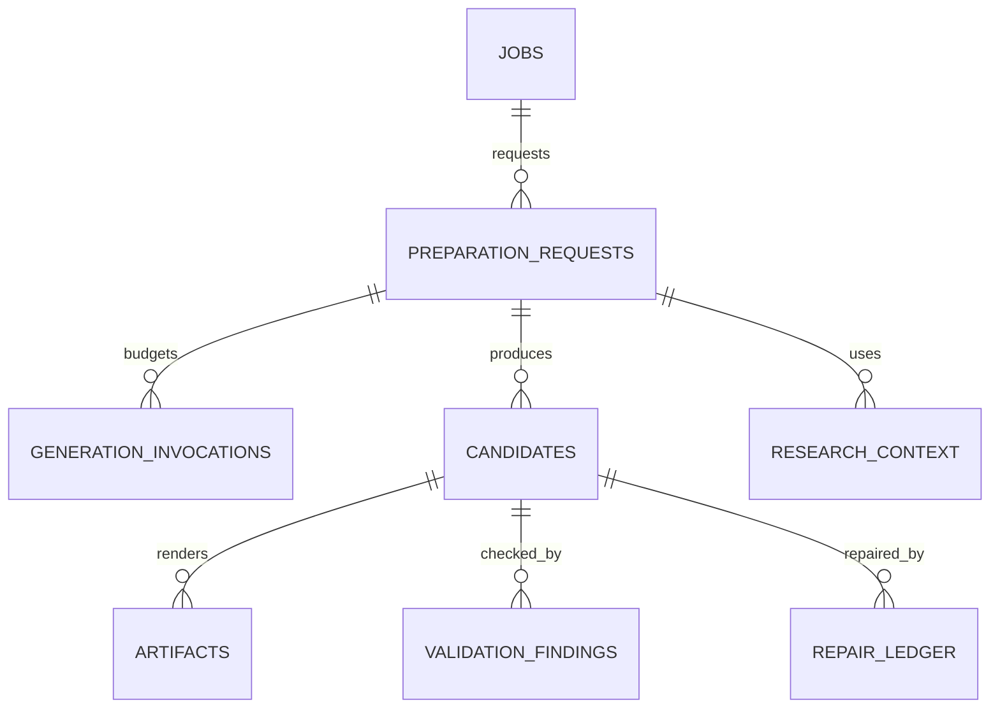

# Application Materials — Study Guide

> **Last updated:** 2026-09-19 
> **Source repository:** `prateek-os` 
> **Source baseline:** accepted cleanup HEAD `d67e5cf543e62636a6dfa0ee96d35835028e1e9d` (derived from canonical `main` `e82862bbbaee4cc7a847897b49ad05c23ceab387`) 
> **Source scope:** `services/application-materials/`; Application Materials paths in `apps/discord-bot/` and `ops/macos/`; `supabase/migrations/`; `docs/adr/{0007,0009,0010}-*.md`; and `docs/reviews/application-materials/` 
> **Documentation status:** Current

[Documentation home](../../README.md) · [OS model architecture](../../os-study-guide.md#10-model-and-prompt-architecture) · [User guide](user-guide.md)

## What problem it solves

Tailoring a resume and cover letter repeatedly is expensive, but unconstrained text generation can invent facts, mutate metrics, exceed page limits, or repeat paid work after a crash. Application Materials turns one canonical JobOps job plus verified personal evidence into private review artifacts through a recoverable, evidence-bound pipeline.

The naïve approach asks a model for LaTeX/PDF and retries until it looks right. That gives the model authority over facts and layout, makes failures hard to diagnose, and can spend the same generation budget again after process death. This system separates evidence, research, structured generation, deterministic rendering, validation, repair, selection, and delivery.

## User/product objective

Prepare a tailored one-page resume and one-page cover letter quickly, without inventing experience and without ever submitting an application automatically. The terminal product state is human review, not “applied.”

**Operational status:** worker dormant; dedicated rehosting deferred; owner-facing retirement/deactivation scheduled in J5. The A1/A2 architecture and acceptance evidence remain documented, but the worker is not operating as an active owner workflow. Requests can queue; processing is paused.

## Where it sits in Prateek OS

## Major components

| Component          | Responsibility                                               | Inputs                                 | Outputs/state                                |
| ------------------ | ------------------------------------------------------------ | -------------------------------------- | -------------------------------------------- |
| Discord control    | Authorize and resolve 📄/`/prepare`                          | Stored notification identity or job ID | One idempotent request                       |
| Queue/repository   | Enqueue, claim, heartbeat, reclaim, acknowledge              | Request + worker identity              | Durable lifecycle and lease                  |
| Evidence catalog   | Stable verified facts with provenance                        | Sanitized master evidence              | Selectable evidence IDs                      |
| Research cache     | Company-base and exact-role context with freshness           | Job/company identity                   | Provenanced bounded facts                    |
| Generation backend | Produce structured resume/letter content                     | Evidence IDs + context + policy        | Schema-valid candidates and usage when known |
| Invocation journal | Reserve logical request-wide budget and checkpoint results   | Invocation identity                    | Consumed ordinals and responses              |
| Renderer/compiler  | Escape and render deterministic LaTeX; run bounded `latexmk` | Structured content                     | PDF candidates and diagnostics               |
| Validators         | Fact, identity, page, geometry, typography, overflow checks  | Candidate + evidence/PDF               | Findings and severity                        |
| Repair/selection   | Batch findings, bound calls, keep better candidate           | Findings + journal                     | Selected resume/letter                       |
| Delivery           | Attach private selected PDFs; support redelivery             | Selected artifacts                     | Discord message metadata                     |

## End-to-end flow

1. An authorized user reacts 📄 to a genuine persisted JobOps notification. The system looks up the stored channel/message mapping; it never trusts rendered job text.
2. A deterministic preparation identity converges reactions from both channel copies and repeated `/prepare` calls.
3. The local worker atomically claims one request with a 120-second lease and renews ownership while active.
4. Verified evidence and fresh company/role research form a bounded generation context.
5. Before each provider call, the request-wide journal reserves the next legal ordinal. The reservation is consumed even if the process dies or the provider response is ambiguous.
6. A valid structured response is checkpointed before LaTeX/PDF work.
7. Deterministic rendering escapes content, compiles under a whole-process timeout, inspects the PDF, and maps diagnostics back to semantic blocks.
8. High-severity findings are repaired in a bounded batch; low-only polish is optional and capped. Resume and cover letter share an initial call but retain independent repair budgets.
9. The best acceptable candidates are selected and privately delivered.
10. The request stops at `NEEDS_HUMAN_REVIEW`/successful preparation. A person reviews and applies manually.

If the worker dies after a model response was checkpointed but before PDF production, reclaim replays the deterministic stages without another call. If it dies after a reservation but before a checkpoint, that ordinal remains consumed: bounded cost wins over guessing whether the paid call occurred.

## Technology choices

- **Local pull worker:** Railway cannot initiate work on a personal computer, and local LaTeX plus the selected generation CLI required a local runtime. Pulling from Supabase keeps control portable.
- **Structured generation:** a typed content contract makes fact validation and deterministic rendering possible.
- **LaTeX/PDF tools:** provide consistent professional layout and inspectable one-page constraints; the model does not own formatting.
- **PostgreSQL journal and leases:** process memory cannot survive crash/reclaim or prove request-wide budgets.
- **Private Discord attachments:** useful delivery without creating public artifact URLs.

Viable alternatives include a hosted document renderer, direct provider API, HTML/CSS PDF, or a template service. The repository does not record a complete comparative bake-off. The current evidence shows speed and reuse of local tooling won initially; runtime reliability now justifies a future provider/execution repair without discarding the safety architecture.

## Data model

Key identities include the canonical job, request idempotency key, generation policy, evidence set, research context, content fingerprint, invocation ordinal, candidate number, and selected artifact mapping. These prevent a repaired or replayed request from quietly using changed inputs.

Generation-input fingerprints are versioned. A canonical JSON algorithm recursively sorts object keys while preserving array order, because PostgreSQL JSONB may return equivalent objects in a different insertion order. Historical legacy hashes remain provenance and use stricter independent lineage checks rather than unsafe recomputation.

## Security and privacy

- Only authorized actors in configured job channels can trigger the primary reaction flow.
- Requests resolve through canonical JobOps mappings, not arbitrary Discord text.
- Evidence is allow-listed and provenance-bearing; unavailable or unverified facts are excluded.
- Generated claims must reference stable evidence IDs. Changed metrics, unsupported skills, and fictional history fail validation.
- Queue/artifact/research/journal tables are backend-only under forced RLS.
- Artifacts are private attachments, never public URLs.
- Local paths reject traversal/symlink escapes and use stable internal IDs.
- Subprocess errors and provider failures are classified/sanitized.
- Human review is mandatory; no application submission exists.

## Integration architecture

### JobOps and Discord

JobOps supplies the canonical job and the durable notification mapping. Both a `#jobs-new` and `#jobs-hot` copy map to the same request identity. Delivery goes to the private configured materials channel.

### Supabase

The database owns queue status, lease authority, journal reservations/checkpoints, research lineage, candidates, findings, selected artifacts, and delivery metadata. Recovery decisions are performed through guarded functions rather than ad hoc row edits.

### Local runtime

Separate LaunchAgents supervise Patrick and the worker. The worker can be stopped without losing queued state. Sleep/wake and crash recovery were explicitly accepted.

### Generation/model backend

The `GenerationBackend` contract is vendor-neutral, but the accepted live path used a local Codex CLI process. The system truthfully leaves model/token/cost fields unknown when the CLI cannot provide them. There is no current multi-provider router for this domain.

## Deterministic logic

Deterministic stages own:

- evidence selection/eligibility;
- identity and metric preservation;
- LaTeX escaping and template layout;
- process timeout and child cleanup;
- PDF page count, geometry, semantic block mapping, overflow, and typography diagnostics;
- repair budgeting and candidate comparison;
- request/input fingerprints;
- selection and redelivery.

The generator is allowed to choose language and emphasis only inside verified evidence bounds.

## LLM/model integration and prompt engineering

The model is used because tailoring prose and selecting emphasis are judgement-heavy. It is not used as a fact database or layout engine.

A sanitized prompt pattern is:

    SYSTEM:
    Produce structured application content only.
    Use only the supplied evidence identifiers.
    Do not invent metrics, employment, credentials, or company facts.
    Return data matching the schema.

    CONTEXT:
    Verified evidence: [bounded records]
    Job requirements: [bounded canonical facts]
    Company/role research: [provenanced facts]

    OUTPUT:
    { "sections": [...], "evidence_ids": [...] }

Repairs receive the affected semantic item, exact finding, dimensions/rendered tail, and previous result—not an unconstrained request to “make it better.” Batching related high findings controls cost. Malformed or schema-invalid output fails closed.

The public guide does not reproduce the private voice profile, full prompt, master resume content, or exact evidence corpus.

## Concurrency, idempotency, and failure recovery

- One logical job request is idempotent across channels/reactions/commands.
- Row locking and lease tokens prevent simultaneous claims.
- Heartbeats keep long generation work owned; stale workers cannot acknowledge after reclaim.
- Reservations consume the request-wide model budget before a call.
- Checkpointed structured output permits deterministic continuation without paying again.
- Recovery hydrates prior invocations, candidates, repairs, and selection instead of restarting ordinal 1.
- Specific guarded continuation paths exist for historical defects such as fingerprint, validation replay, PDF mapping, and LaTeX timeout recovery.
- Delivery failure does not change successful generation truth; `/prepare` can redeliver selected PDFs without regeneration.
- Failed requests do not automatically restart an expensive generation path.

## Testing strategy

This system has unusually deep failure-oriented tests:

| Test family          | What it tries to break                                                                                                |
| -------------------- | --------------------------------------------------------------------------------------------------------------------- |
| Evidence/fact policy | duplicate IDs, untraceable facts, invented skills, altered metrics, fictional history, unsupported company assertions |
| Generation schema    | malformed output, missing identity, changed identity, backend timeout/nonzero exit, child stdin failure               |
| Budget/recovery      | crash after reserve, crash after checkpoint, ordinal reuse, optional-polish reuse, legacy unjournaled progress        |
| Fingerprints         | JSONB key reordering, array changes, negative zero, circular/sparse/non-JSON values                                   |
| Queue/ownership      | duplicate enqueue, overlapping claims, stale lease, reclaim, late acknowledgement                                     |
| Document production  | LaTeX metacharacters, traversal, compiler failure, whole-process timeout, descendant cleanup, corrupt PDF             |
| PDF semantics        | page count, hyphenation mapping, duplicate/prefix text, adjacent section boundaries, overflow, short final lines      |
| Discord/delivery     | both channel copies, repeated reactions, authorization, private attachments, redelivery across candidate gaps         |

Real LaTeX/PDF tests keep the compiler and inspector real where available. Database integration keeps PostgreSQL JSONB and RPC behavior real; model/Discord calls use fakes for normal tests.

Historical defects became permanent recovery tests: a crash could otherwise reset a paid budget; JSONB key order could reject a valid checkpoint; cover-letter PDF mapping and LaTeX timeout recovery required lineage-bound continuation; and terminal success had to remain true even if Discord delivery failed.

## Real-world acceptance

A2 required more than automated tests:

- one authorized Discord request traversed real research, bounded generation, deterministic LaTeX/PDF production, and private delivery;
- restart/reclaim and several failure-continuation paths were exercised;
- separate LaunchAgents were observed across startup, restart, and physical sleep/wake;
- final artifacts stopped for human review and no application was submitted.

Later operational experience showed the generation backend is not reliable enough for current use. That limitation is stated rather than allowing old acceptance evidence to imply a running service.

## Engineering tradeoffs and lessons

- Reserving before a provider call may waste an ambiguous slot, but prevents unbounded duplicate spend.
- Models are good at prose; deterministic tools are better at identity, evidence, layout, and page geometry.
- Recovery must preserve semantic lineage, not merely rerun a command.
- A real acceptance can prove a path once without guaranteeing its long-term operational reliability.
- The safety architecture (evidence, journaling, validation, privacy, and human approval) remains valid, but dedicated rehosting is deferred and owner-facing retirement/deactivation is scheduled in J5.

## Current limitations

- Worker is dormant / not operating as an active owner workflow; queued requests do not process today.
- Dedicated rehosting is deferred; owner-facing retirement/deactivation scheduled in J5.
- Provider/model/token/cost telemetry may be unavailable and is not guessed.
- Generated content still needs careful human review even after deterministic validation.
- No automatic application submission, outreach, or public artifact hosting.
- Future master-evidence/source updates require deliberate reconciliation and fingerprint/version handling.

## Source map

- `services/application-materials/src/discord-control.ts`, `queue.ts`, `worker.ts`
- `services/application-materials/src/orchestration.ts`, `generation-policy.ts`, `codex-backend.ts`
- `services/application-materials/src/evidence.ts`, `research.ts`, `fact-validation.ts`
- `services/application-materials/src/latex.ts`, `document-production.ts`, `validation.ts`, `repair.ts`
- `services/application-materials/src/runtime-repository.ts`, `runtime-recovery.ts`
- `supabase/migrations/20260820000000_application_materials_foundation.sql` through `20260829000000_application_materials_latex_timeout_recovery.sql`
- `ops/macos/application-materials/`
- `docs/adr/0007`, `0009`, `0010`
- `docs/reviews/application-materials/A1/`, `A2/`
