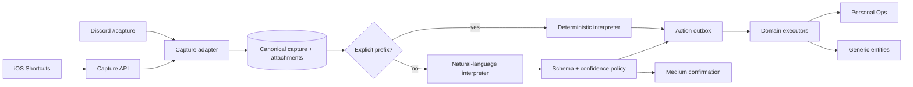
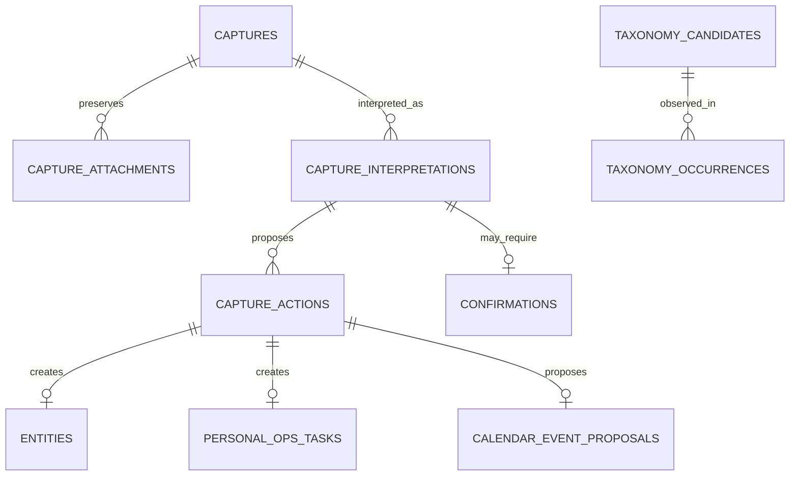

# Capture — Study Guide

> **Last updated:** 2026-09-19 
> **Source repository:** `prateek-os` 
> **Source baseline:** accepted cleanup HEAD `d67e5cf543e62636a6dfa0ee96d35835028e1e9d` (derived from canonical `main` `e82862bbbaee4cc7a847897b49ad05c23ceab387`) 
> **Source scope:** `services/capture/`; `apps/capture-api/`; Capture paths in `apps/discord-bot/`; `packages/llm-router/`; `supabase/migrations/`; `docs/adr/0012-c3-natural-language-interpretation.md`; and `docs/reviews/capture/` 
> **Documentation status:** Current

[Documentation home](../../README.md) · [OS model architecture](../../os-study-guide.md#10-model-and-prompt-architecture) · [User guide](user-guide.md)

## What problem it solves

Useful inputs arrive in inconvenient forms: a Discord thought, link, screenshot, shared text, document, or voice transcript. Without one safe front door, each future system grows its own ingestion, attachment, identity, permission, and retry logic. Capture preserves the raw input first, then interprets and routes bounded derived actions without letting interpretation rewrite the source.

The naïve implementation immediately parses a Discord message and creates an item. It loses the original on parser failure, duplicates work when Discord redelivers, exposes unsafe URL fetches, and cannot explain what a model saw. Capture separates ingress, canonical persistence, interpretation, confidence, confirmation, and action execution.

## User/product objective

Let an authorized user offload something quickly from Discord or iPhone and trust that:

- the original is preserved;
- explicit syntax remains a free deterministic path;
- natural language works for ordinary input;
- ambiguity asks or safely does nothing;
- consequential external changes remain separately approval-gated;
- provider failure never destroys the Capture.

**Status: IMPLEMENTED · HOSTED DEV**, including C1 deterministic Capture, C2 mobile ingress, and C3 natural-language interpretation accepted on real Discord/iPhone workflows.

## Where it sits in Prateek OS

## Major components

| Component                  | Responsibility                                                 | Inputs                                 | Outputs/state                         |
| -------------------------- | -------------------------------------------------------------- | -------------------------------------- | ------------------------------------- |
| Discord adapter            | Channel/user/bot gates, bounded attachment download, reactions | Gateway message                        | Typed ingest request/outcome          |
| Capture API                | Bearer auth, bounded JSON/multipart ingress, mobile provenance | Shortcut/program request               | Same ingest contract                  |
| Repository                 | Atomic canonical persistence and idempotency                   | Actor key, raw text/files, source time | Capture, attachments, parsed URLs     |
| ProductionInterpreter      | Fixed prefixes/task phrases/URL-attachment rules               | Canonical input                        | Deterministic classifications/actions |
| NaturalLanguageInterpreter | Bounded evidence extraction and provider call                  | Canonical input + context              | Schema-valid proposal or safe unknown |
| Registry/schema            | One versioned taxonomy and property contract                   | Classification catalog                 | Prompt/schema/type generation         |
| Confidence policy          | Deterministic high/medium/low decision                         | Validated result + structural signals  | Final band/action gating              |
| Confirmation service       | Durable medium-confidence approve/reject/correction lifecycle  | Interpretation identity                | Superseding decision and actions      |
| Action outbox              | Claim, lease, replay, retry, approval fence                    | Persisted action                       | Executor outcome/state                |
| Executors                  | Create generic entities, tasks, or Calendar proposals          | Stored action parameters               | Domain-owned records                  |
| Preprocessors              | Bounded text/image/PDF/URL context with SSRF defenses          | Private attachment/link                | Provider evidence notes               |
| Owner notifications        | Durable mobile-origin confirmation/failure delivery            | Pipeline outcome                       | Retryable Patrick message             |

## End-to-end flows

### Explicit deterministic capture

`idea: compare lease fencing strategies`

1. Discord verifies channel and authorized actor before downloading anything.
2. The exact text and timestamp are atomically stored. Discord message ID is the idempotency key.
3. The explicit prefix bypasses the model.
4. The interpreter produces an `idea` action.
5. The action outbox claims it; the generic executor creates one linked entity.
6. Patrick reacts ✅. Re-delivery converges on the same Capture and returns 🔁.

### Natural-language task

“Call the clinic tomorrow afternoon for 20 minutes.”

1. Canonical persistence happens before interpretation.
2. Bounded prompt context is assembled; the provider returns structured classification/properties.
3. Schema validation checks the registry contract. Code resolves “tomorrow afternoon” from original `captured_at` and time zone.
4. Confidence policy checks ambiguity, missing fields, multi-item input, short executable imperatives, and unresolved backreferences.
5. A high result creates a canonical Personal Ops task with duration and a soft preferred window. Medium opens a confirmation; low/provider failure becomes `unknown` with no action.

### Natural-language event

“Meet Sam tomorrow at 3pm.”

Even a high semantic classification does not write Calendar. The event executor creates a separate exact Calendar-event proposal. A button approval is required before the Personal Ops Calendar adapter writes one event. If duration is absent, the proposal explicitly labels the default instead of claiming it was stated.

### Medium correction

While a medium confirmation is open, replying to that specific Patrick message with a correction supplies bounded prior context for a new interpretation attempt. General conversation threading and later correction of completed captures are not implemented.

## Technology choices

- **Canonical-first PostgreSQL persistence:** raw data survives any downstream failure.
- **Action outbox:** avoids coupling the ingress response to every destination and makes retry/replay durable.
- **Deterministic prefix path:** predictable, fast, free, and useful during provider/config problems.
- **Provider-neutral structured model path:** handles natural language without handing the provider direct domain authority.
- **Discord plus HTTP API:** one domain service supports chat and mobile clients.
- **Private object storage:** attachments remain backend-readable and content-hashed.
- **Bounded synchronous interpretation:** no second model queue was added because the existing action outbox handles asynchronous side effects; typical interpretation latency was acceptable.

The repository does not claim every alternative was benchmarked. A separate worker could reduce request latency, but would add another queue/recovery lifecycle. The accepted design favored reuse of the existing Capture transaction/outbox.

## Data model

Canonical raw text and source metadata never become the mutable “current interpretation.” Interpretations have attempts and version metadata. Actions persist their destination, operation, parameters, temporal intent, approval flag, status, attempts, and lease authority.

The input fingerprint covers meaningful request content, including separated Share Sheet context. Same key/same fingerprint replays; same key/different fingerprint conflicts instead of silently discarding changed content.

## Security and privacy

- Discord actor/channel checks happen before attachment fetching or persistence.
- Empty allow-list rejects all; missing Capture channel disables Capture only.
- Server assigns source and actor identity; clients cannot forge them.
- Discord attachments accept only approved HTTPS CDN hosts, reject redirects, and enforce per-file/count/aggregate streaming limits and timeout.
- General URL context uses scheme/address/redirect/size/time restrictions and DNS-rebinding defenses to mitigate SSRF.
- Attachments remain in a private bucket with checksum provenance.
- API bearer credentials are checked before mutation and never reflected.
- Source permissions are checked before cloud model calls; `local_only`/`blocked` material is not sent.
- Provider errors and action failures become bounded codes/copy, not raw secret-bearing messages.
- `requires_approval` blocks an action before executor lookup.
- Calendar mutation has a second independent approval gate.

## Integration architecture

### Discord

The bot is an ingress/rendering adapter. It reacts ✅ for accepted pipeline completion, 🔁 for replay, 🚫 for unauthorized actor, and ⚠️ for invalid/unsafe input. Medium results and Calendar proposals use separate button messages. Owner notifications make equivalent outcomes visible for mobile-origin captures.

### iOS Shortcuts and Capture API

The Action Button voice Shortcut sends the transcript plus original audio as one Capture. The Share Sheet supports URL, selected text, image, or file and a separate optional “why saved” context note. Base64 variants preserve quotes, newlines, emoji, and Unicode without fragile interpolation. Both clients use idempotency and bounded provenance markers.

### Personal Ops

The task executor creates canonical tasks. Natural-language duration/preferred windows remain derived inputs; hard earliest/deadline fields are set through explicit Personal Ops command options. Event execution creates a proposal, never direct Calendar mutation.

### Model providers

`packages/llm-router` exposes Gemini and OpenAI adapters plus deterministic fakes. The selected Capture default came from a real evaluation, while an alternate remains supported. Usage and model-run outcome are recorded when truthfully available.

## Deterministic logic

### Fixed interpreter

It recognizes an allow-list of prefixes, a bounded set of task phrases, URL-dominant/attachment-dominant references, and safe multi-classification when a known prefix also has a URL. Unknown text produces `unknown` and zero actions. This is intentionally not a regex imitation of general language understanding.

### Registry and schema

The natural-language taxonomy is versioned in one TypeScript registry. Prompt catalog and response validation derive from it, preventing drift between “what the model may say” and “what code accepts.” Types that have no executor can be classified and preserved but remain `deferred` rather than triggering invented behavior.

### Confidence policy

The model's self-reported confidence is advisory. Code caps or forces bands based on missing fields, ambiguities, contradictions, multi-item input, underspecified short imperatives, and unresolved contextual backreferences. Policies are versioned and regression-tested.

### Temporal resolution

The model may identify the raw phrase; deterministic code resolves it against source time and IANA time zone. It handles relative times, weekdays including a distinct “next weekday” rule, dayparts, and DST. Unresolvable bare-hour/day-of-month cases ask/return safely rather than guessing.

### Title normalization

The model owns semantic casing, while a narrow deterministic repair restores a dropped leading task action verb in one structural failure shape. The code deliberately avoids an ever-growing linguistic rewrite engine.

## LLM/model integration and prompt engineering

The model is used for semantic classification and property extraction that fixed rules cannot cover naturally. It is not used for identity, time arithmetic, confidence authority, executor permission, or Calendar mutation.

Prompt assembly includes:

- a clear classifier role;
- the versioned allowed taxonomy and property keys;
- explicit instructions to report ambiguity/missing information;
- bounded raw text, owner-context note, attachment notes, and URL excerpts;
- strict structured output;
- constraints against inventing dates or splitting multiple unrelated thoughts;
- optional prior proposal plus owner correction for a pending confirmation.

  SYSTEM:
  Choose one allowed classification from supplied evidence.
  Mark ambiguity and missing requirements explicitly.
  Return JSON matching the schema; do not calculate absolute dates.

  INPUT:
  Captured at: <source instant and timezone>
  Text: <synthetic example>
  Bounded context: <optional excerpts>

Deterministic post-processing rejects out-of-registry classifications/properties, resolves time, normalizes bounded mechanics, and chooses the band. Provider timeouts/rate limits/schema errors receive at most a small total attempt budget; exhaustion becomes safe `unknown`.

The real evaluation corpus exposed safety failures a schema alone cannot catch: a bare imperative was confidently classified as executable by both providers, and a longer sentence with an unresolved backreference also reached high confidence. Prompt clarification plus two structural policy backstops fixed those general shapes. Full private prompts and personal examples are omitted.

## Concurrency, idempotency, and failure recovery

- Ingress uses actor-scoped idempotency plus a request fingerprint.
- Canonical row/idempotency ownership/attachment rows commit together after private upload.
- Interpretation/actions/state commit atomically.
- Action claims use `FOR UPDATE SKIP LOCKED`, bounded leases, and lease tokens.
- Replayed actions use stored temporal targets; they do not reinterpret “tomorrow.”
- Reinterpretation rereads original stored input and is refused when a successful interpretation exists.
- Concurrent re-drive attempts converge on one attempt/action set.
- Medium confirmation decisions are fenced and replay-safe.
- Durable owner notifications are claimed/retried and become terminal after a cap.
- A post-commit drain failure is logged without invalidating canonical Capture success.

## Testing strategy

| Test family        | What it tries to break                                                                                                       |
| ------------------ | ---------------------------------------------------------------------------------------------------------------------------- |
| Ingress/auth       | wrong channel, bots, empty allow-list, forged source, bad token, oversized/streaming body                                    |
| Attachments/URLs   | unapproved host/scheme, redirects, declared-vs-streamed size mismatch, too many files, SSRF/DNS rebinding, unsupported media |
| Persistence        | same-key races, different-payload reuse, attachment atomicity, exact raw/base64 Unicode preservation                         |
| Interpreter        | prefix boundaries, false task phrases, URL dominance, unsupported time words, multi-classification, safe unknown             |
| Model schema/retry | malformed JSON, invented type/property, timeout/rate limit, terminal auth error, bounded attempts, usage accounting          |
| Confidence         | ambiguity, missing required fields, short imperatives, null properties, unresolved backreferences, multiple items            |
| Temporal           | capture-time anchoring, next-weekday semantics, DST/tzdata, dayparts, unsupported ambiguity                                  |
| Confirmation       | approve/reject/expire/late approve, duplicate decision, correction reply, concurrent attempts                                |
| Outbox             | stale lease, duplicate claim, replay, expired temporal action, approval fence before executor                                |
| Integrations       | real local DB/RLS, task convergence, Calendar proposal separation, mobile notification parity                                |

Tests keep clocks/providers/network/Discord deterministic where useful and keep real PostgreSQL for concurrency/migration contracts. Real provider bake-offs and owner acceptance remain separate because unit fakes cannot prove provider behavior or the iPhone/Discord surfaces.

Historical findings that became regressions include streamed attachment size exceeding its declared value, DNS rebinding, a model confidence safety gap, a Zod schema silently stripping a newly added temporal field, Share Sheet commentary being concatenated with shared content, and a post-closeout “next weekday” DST/tzdata correction.

## Real-world acceptance

- C1: real Discord `#capture` manual acceptance locally, then hosted DEV activation and a real end-to-end Capture smoke.
- C2: both Action Button and Share Sheet were installed and physically exercised across voice, URL, text, image, and file shapes.
- C3: real provider comparison, hosted DEV natural-language activation, Discord/iPhone behavior acceptance, and final targeted re-tests for scheduling fields, title verb, proper-noun casing, and next-weekday grammar.
- Real Calendar proposal rows were tested through the Personal Ops approval boundary; model output never served as direct mutation authority.

## Engineering tradeoffs and lessons

- Preserve first, interpret second: model outages become classification degradation, not data loss.
- Explicit prefixes remain valuable even after natural language ships.
- A strict schema stops malformed shapes, not confident semantic mistakes; deterministic policy and realistic corpora remain necessary.
- One logical Capture avoids unsafe arbitrary segmentation; richer multi-item handling is deferred.
- Synchronous model interpretation is simpler at current scale but adds ingress latency.
- Attachment content support is bounded and format-specific; preserving an unsupported file is better than pretending it was interpreted.

## Current limitations

- General multi-item segmentation is not built.
- Completed captures cannot be conversationally corrected later; only a pending medium confirmation supports a bounded reply correction.
- No general Patrick query/intent router or JobOps routing.
- Several taxonomy types have no executor and remain catalogued/deferred.
- Purchase approval UI is not wired.
- HEIC/HEIF and scanned/image-only PDF interpretation are unsupported.
- Some temporal phrases fail closed with clarification.
- All accepted operation is hosted DEV, not PROD.

## Source map

- `services/capture/src/service.ts`, `repository.ts`, `interpreter.ts`
- `services/capture/src/nl-interpreter.ts`, `nl-prompt.ts`, `nl-schema.ts`
- `services/capture/src/confidence-policy.ts`, `registry.ts`, `nl-temporal.ts`
- `services/capture/src/confirmation-service.ts`, `attachment-preprocessor.ts`, `url-context.ts`
- `apps/discord-bot/src/capture.ts`, `capture-router.ts`, `owner-notification-drain.ts`
- `apps/capture-api/src/handler.ts`
- `supabase/migrations/20260905000000_universal_capture_foundation.sql` through `20260913000000_c3_action_failed_notification.sql`
- `docs/adr/0012-c3-natural-language-interpretation.md`
- `docs/reviews/capture/C1/`, `C2/`, `C3/`
