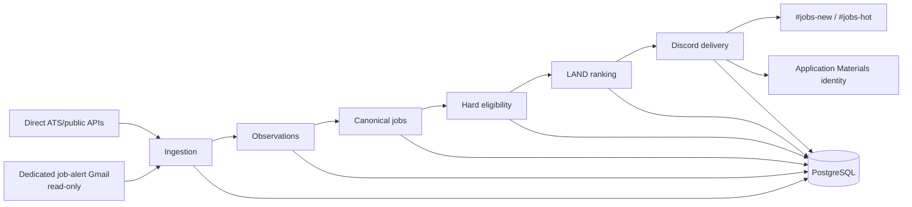
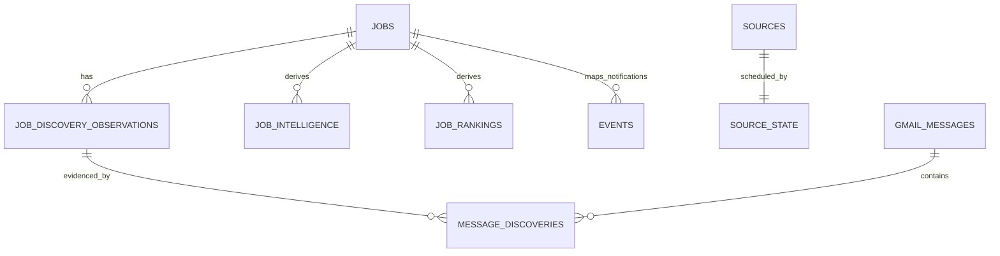

# JobOps — Study Guide

> **Last updated:** 2026-09-05 
> **Source repository:** `prateek-os` 
> **Source baseline:** `76edfe8635c5abf075c12e47eaa39b70f1b1bce5` 
> **Source scope:** `services/jobops/`; JobOps paths in `apps/discord-bot/`; `supabase/migrations/`; `docs/adr/000{1,2,3,4,5}-*.md`; and `docs/reviews/jobops/` 
> **Documentation status:** Current

[Documentation home](../../README.md) · [OS scheduling and leases](../../os-study-guide.md#8-scheduling-and-recurring-work) · [User guide](user-guide.md)

## What problem it solves

Job search is a data-quality and attention-allocation problem before it is an AI problem. Postings arrive through different ATS feeds and email alerts, repeat across sources, change over time, omit fields, and can create notification noise. JobOps builds a canonical, explainable stream of Canadian opportunities and prioritizes them deterministically.

The naïve system polls every source, fuzzy-matches titles, scores before persistence, and posts immediately. That loses provenance, overmerges different roles, duplicates notifications on retry, and makes source failure indistinguishable from “no jobs.” JobOps separates observation, canonical identity, eligibility, ranking, delivery, and scheduling.

## User/product objective

Reduce time-to-application for plausible Canadian opportunities while preserving broad evidence for later analysis. A high-priority notification is a triage aid, not an employment or immigration guarantee. JobOps never applies to a job or contacts anyone.

## Where it sits in Prateek OS

## Major components

| Component               | Responsibility                                                              | Input                           | Output / state                                   |
| ----------------------- | --------------------------------------------------------------------------- | ------------------------------- | ------------------------------------------------ |
| Source registry         | Typed source/company configuration and monitoring metadata                  | Versioned JSON                  | Enabled source definitions                       |
| Collectors              | Fetch Greenhouse, Lever, Ashby, Amazon public data                          | Provider source                 | Bounded raw job records                          |
| Gmail transport/parsers | Read a dedicated label with `gmail.readonly`; parse known alert templates   | Bounded messages                | Provider-neutral candidates and safe diagnostics |
| Normalizer              | Normalize title, locations, workplace, salary, timestamps                   | Raw record                      | Canonical candidate shape                        |
| Identity repository     | Apply strong identity precedence and preserve observations                  | Candidate + source              | Stable job plus observation/provenance           |
| Eligibility             | Apply conservative Canada/seniority/credential hard gates                   | Normalized job                  | Eligibility and bounded reason                   |
| Intelligence/ranking    | Extract deterministic requirements and calculate versioned LAND ranking     | Canonical job + private profile | Derived intelligence, component scores, bucket   |
| Scheduler               | Select due sources on absolute Toronto slots under one lease                | Source state + clock            | Finite source batch and health state             |
| Notifier                | Render bounded Discord messages and finalize each destination independently | Current ranking                 | `#jobs-new`/`#jobs-hot` delivery state           |
| Demand query            | Count canonical company activity over fixed windows                         | Jobs + observations             | Read-only operator report                        |

## End-to-end flow

Consider the same posting seen first on a company ATS and later in a job-alert email:

1. The ATS collector returns a source-native ID, URL, raw fields, and provider payload.
2. JobOps normalizes the record but retains raw evidence in a Capture/provenance layer.
3. Strong source/external identity creates a canonical job and first observation atomically.
4. Eligibility code confirms Canadian evidence and checks only narrow hard blockers.
5. Derived intelligence extracts requirements and calculates a versioned ranking.
6. Current, eligible results become independently pending for one or both Discord destinations.
7. The notifier sends, binds the returned Discord identity to the canonical job in a database transition, then seeds 📄.
8. The later email creates another observation. Strong job-specific identity can converge on the same job; title similarity alone cannot.
9. Because delivery acknowledgement already exists per channel, no duplicate notification is sent.

## Technology choices

- **Public provider feeds instead of browser scraping:** faster, cheaper, and less brittle where available. The system deliberately does not automate LinkedIn interaction or scrape LinkedIn/Indeed pages.
- **Read-only Gmail ingestion:** extends coverage using alerts already sent to a dedicated account without granting send/delete access or storing full bodies.
- **Sequential source execution:** simpler rate behavior and source isolation; concurrency was rejected until scale requires it.
- **One five-minute Railway dispatcher:** portable finite process plus database schedule state, rather than a permanently hosted scheduler or one cron per source.
- **Deterministic ranking:** fully explainable and rebuildable. No model call is required for ingestion, eligibility, NOC/TEER heuristic, or LAND ranking.
- **PostgreSQL functions for atomicity:** canonical writes, claims, and delivery finalization need stronger guarantees than an in-memory sequence.

The repository records specific corrections to early scheduling rather than a formal infrastructure bake-off. Live Railway behavior showed that sweeping the whole registry caused long bursts; absolute per-source scheduling replaced the original tier-derived cadence.

## Data model

- `jobs` is the canonical current record.
- An observation is one source sighting. Recurrence updates bounded state instead of inserting infinite duplicates.
- Intelligence and rankings are versioned derived rows. Old versions remain history.
- Source state records bootstrap, attempts, failures, cooldown, and alert state independently from job provenance.
- Message transport state is distinct from parsed discoveries, so one malformed message does not poison the whole Gmail source.

Identity precedence is intentionally conservative:

    provider-native identity
      else trusted canonical job URL
      else create a separate canonical record

A content fingerprint helps detect changes and cache derived work; it is not sufficient by itself to merge different jobs.

## Security and privacy

- Gmail OAuth uses exactly read-only scope and verifies the configured account and label.
- Full Gmail bodies, MIME trees, attachments, tokens, and OAuth material are not persisted as normal JobOps data.
- Fixture exports are explicit, sanitized, confined to a repository-private ignored directory, and written with restrictive permissions.
- Symlink and traversal attempts are rejected.
- Database tables use forced RLS and backend-only privileged access.
- Unknown/foreign location fails closed for notification but remains stored.
- Error messages are classified, sanitized, and bounded before persistence/Discord.
- PROD remains separate and untouched by current accepted operation.

## Integration architecture

### Discord

`#jobs-new` receives every current hard-eligible job with a ranking. `#jobs-hot` is a stricter interrupt channel requiring the strongest location class and top recommendation bucket. Each destination has independent pending/sent/suppressed state. Application Materials resolves 📄 through the stored Discord mapping, never by parsing prose.

### Railway

Railway invokes `pnpm jobops:scheduled` every five minutes. The dispatcher acquires the singleton runner lease, waits bounded deterministic dispatcher jitter, calculates due source targets in `America/Toronto`, processes sources sequentially, persists health, releases, and exits.

### Gmail

The Gmail transport checks a dedicated label with bounded lookback, pages, messages, nesting, parts, and bytes. Known senders/templates are parsed without following links or fetching page resources. Unsupported versus malformed templates have different durable outcomes.

### Supabase

PostgreSQL owns canonical identity, observation linkage, leases, rankings, source health, and notification acknowledgement. A local real Supabase instance is used for integration proofs before hosted DEV gates.

## Deterministic logic

### Eligibility before ranking

Hard suppression requires positive evidence: clearly outside/unknown Canada availability, clear senior organizational leadership, or an explicitly mandatory regulated credential. Ordinary skill gaps, years-of-experience differences, and words such as “lead” are soft ranking inputs rather than automatic rejection.

### LAND ranking

LAND is a versioned pre-employment priority mode. It combines public-safe component categories including Canadian work/immigration usefulness, hire likelihood, current and prep-adjusted fit, freshness, location, career transition/preference, company desirability, and compensation.

    land_score =
        eligibility-preserving strategic value
      + current/preparable fit
      + freshness and location
      + smaller preference/company/compensation signals

Exact personal weights and profile rules are intentionally omitted. Hard-ineligible jobs receive an explainable `IGNORE` result instead of being allowed to “score through” the gate. Freshness has discrete transitions; cached rankings expire at their next transition and are recomputed before notification.

### Requirement extraction

The intelligence layer uses bounded grammars and controlled aliases. It distinguishes applicant requirements from third-party biographies, product audiences, preferences, and incidental keyword mentions. Ambiguity yields no invented mandatory requirement. Probable NOC/TEER is a deterministic, versioned heuristic with confidence/evidence—not legal advice.

### Scheduling

Sources receive stable hash-derived phases and slot-specific deterministic jitter. Daytime/overnight cadences differ, survive restarts and DST, and never derive the next target from actual completion. Provider groups are interleaved to avoid permanent request bursts.

## LLM/model integration

JobOps does not use an LLM at runtime. This is a deliberate boundary: source identity, eligibility, ranking, and notification must be explainable, cheap, fast, and reproducible. Application Materials may later use model generation after a job is selected, but that is a separate domain with its own evidence and approval rules.

## Concurrency, idempotency, and failure recovery

- One heartbeated runner lease prevents overlapping scheduled/reclassification runs.
- Losing lease ownership stops new source work and fences stale completion.
- Provider retries are capped; cooldown prevents persistent failures from creating alert storms.
- Each source result is isolated so a broken feed does not starve later sources.
- Gmail claims use leases and attempt caps; a message-local problem does not necessarily fail Gmail transport health.
- Strong identity and unique constraints converge replayed observations.
- Notifications are once-per-destination; a partial success retries only the missing channel.
- Backfill/reclassify rebuild derived results without re-sending notifications.

## Testing strategy

JobOps' tests are designed as attacks on its contracts:

| Test family          | What it tries to break                                                                                                                            |
| -------------------- | ------------------------------------------------------------------------------------------------------------------------------------------------- |
| Collectors/HTTP      | timeouts, rate limits, schema drift, pagination, truncation, provider retries                                                                     |
| Identity/integration | conflicting IDs, generic URLs, cross-source convergence, exact replay, atomic provenance                                                          |
| Eligibility          | foreign/ambiguous place names, Canadian alternatives, remote wording, credential negation/preference, overly broad seniority                      |
| Ranking              | profile drift, incidental keywords, education subject confusion, mandatory vs preferred requirements, freshness expiry, hard-gate mismatch        |
| Scheduler            | overlapping runs, heartbeat loss, stale reclaim, absolute-slot drift, DST, hash edges, provider bursts, catch-up storms                           |
| Gmail                | wrong account/label, MIME nesting and bombs, attachment exclusion, pagination overlap, source-wide 429 vs message-local failure, sanitized export |
| Discord              | independent channel acknowledgement, 429 timing, critical-field message budgeting, mapping/finalization failure                                   |
| Demand               | posted vs discovered time, canonical double-counting, filters, provider history boundaries                                                        |

Real local PostgreSQL tests keep database functions, uniqueness, and transaction boundaries real while external HTTP/Discord/Gmail use deterministic fakes. Sanitized provider fixtures retain structure without private messages.

Important historical regressions include:

- the original tier-based cadence created long live Railway sweeps and was replaced by anchored scheduling;
- a live location corpus exposed ambiguous municipality/foreign-list cases;
- education text mentioning doctoral students in a product/audience context was once at risk of becoming a false applicant requirement;
- Gmail parser work had to separate a message-local failure from provider/source health;
- notification finalization was made atomic with its durable Discord mapping.

## Real-world acceptance

Automated proof was supplemented by:

- real dry runs against supported feeds;
- local and hosted DEV schema/RLS verification;
- Railway finite-run and recurring schedule observation;
- live Discord persistence/dedup/rate-limit recovery;
- a controlled DEV acceptance harness that traversed the real pipeline and verified replay without duplication;
- J4 hosted census checks over direct sources plus Gmail, followed by independent final audit.

Private account content, source details, identifiers, and acceptance fixtures are omitted here.

## Engineering tradeoffs and lessons

- False merges are more damaging than duplicate canonical records; fuzzy similarity remains diagnostic.
- Persist-before-rank retains opportunities that policy currently suppresses.
- Conservative rules lose some recall but make failures explainable and safe.
- Sequential scheduling is slower than broad concurrency but far simpler at current scale.
- A Railway “production” label is operational metadata, not proof of the database environment.
- Exact personal scoring improves private usefulness but is inappropriate for a public blueprint; publish the mechanics, not the profile.

## Current limitations

- Coverage is broad but not universal; private source inventory and gaps are intentionally not enumerated here.
- Unknown location is suppressed, which creates deliberate false negatives.
- Ranking is heuristic; no hidden hiring or immigration truth is claimed.
- The future post-employment ranking mode is not built.
- Remaining JobOps CRM/outreach/follow-up/interview-prep milestone is planned late.
- Application Materials generation is a separate paused runtime; a JobOps notification does not guarantee documents will be produced today.

## Source map

- `services/jobops/src/collectors.ts`, `amazon.ts`, `ingest.ts`, `normalize.ts`
- `services/jobops/src/repository.ts`, `discovery.ts`, `company-identity.ts`
- `services/jobops/src/eligibility.ts`, `intelligence.ts`, `ranking.ts`
- `services/jobops/src/scheduler.ts`, `scheduled-ingest.ts`
- `services/jobops/src/gmail-*.ts`
- `services/jobops/src/discord.ts`, `demand.ts`
- `supabase/migrations/20260817000000_jobops_j1.sql` through `20260904000000_jobops_j4_5_company_demand.sql`
- `docs/adr/0001` through `0005`
- `docs/reviews/jobops/J1/`, `J1.1/`, `J2/`, `J4/`
