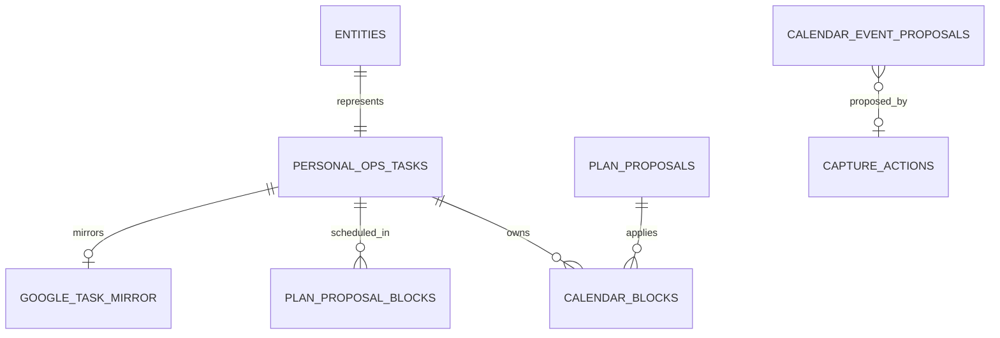

# Personal Ops — Study Guide

[Documentation home](../../README.md) · [OS approval architecture](../../os-study-guide.md#1-project-philosophy) · [User guide](user-guide.md)

## What problem it solves

Tasks, scheduling, Google Tasks, and Google Calendar have different authority. A task is an intention; an existing Calendar event is a real constraint; a proposed time block is not real until approved; and a Google Tasks item is too limited to own rich planning metadata.

The naïve planner edits Calendar directly after finding a slot. It can schedule after a deadline, ignore task changes, duplicate events on a repeated approval, or let an external mirror silently rewrite canonical task state. Personal Ops makes authority explicit and separates plan from mutation.

## User/product objective

Create and review canonical tasks, see near-term work, propose realistic schedules around existing Calendar events, and make external changes only after approving the exact proposal shown.

**Status: IMPLEMENTED · HOSTED DEV.** `/task`, `/today`, `/week`, `/plan`, Google Calendar/Tasks integration, and natural-language task/event Capture paths have accepted real-world evidence.

## Where it sits in Prateek OS

```mermaid
flowchart LR
    U[/task, /today, /week, /plan] --> PO[Personal Ops]
    C[Capture] --> PO
    PO --> T[(Canonical tasks)]
    T --> P[Deterministic planner]
    G[Google Calendar events] --> P
    P --> Q[Immutable plan proposal]
    Q --> H{Approve?}
    H -->|yes + fresh| B[OS-owned Calendar blocks]
    H -->|reject/expire| Z[Zero mutation]
    T --> M[Best-effort Google Tasks mirror]
```

## Major components

| Component                       | Responsibility                                           | Inputs                                          | Outputs/state                                 |
| ------------------------------- | -------------------------------------------------------- | ----------------------------------------------- | --------------------------------------------- |
| Task repository/executor        | Create/converge canonical tasks                          | Slash command or Capture action                 | Typed task + entity link                      |
| Planner                         | Deterministically pack eligible tasks around hard events | Task snapshot, Calendar snapshot, date/timezone | Blocks, unscheduled reasons, capacity summary |
| Planning service                | Persist immutable proposal, decide, revalidate, apply    | Planner output + actor decision                 | Proposal lifecycle and Calendar blocks        |
| Calendar adapter/client         | List/create/update/delete exact Google events            | Approved service call                           | External event result                         |
| Calendar event proposal service | Approval-gate one exact create/update/delete             | Capture event or future callers                 | Durable proposal and result                   |
| Tasks mirror                    | Best-effort downstream representation                    | Canonical task                                  | Mirror status/external identity               |
| OAuth client                    | Refresh tokens and make bounded Google calls             | Private credential store                        | Access token/request result                   |
| Discord adapter                 | Commands, proposal copy, buttons                         | Interaction                                     | Private response/proposal message             |

## End-to-end flows

### Create a task

`/task title:"Write project note" duration:30m earliest:"tomorrow 10am" due:"tomorrow 5pm"`

The command parses a small explicit temporal grammar. Malformed input creates nothing. The task is canonical in PostgreSQL with queryable fields; Google Tasks is optional downstream state. When the mirror is configured, creation attempts a best-effort sync without a second approval prompt. A Capture-created task converges on its unique source action and uses the same mirror behavior.

### Plan a day

1. `/plan tomorrow` selects open, schedulable tasks whose dependency is satisfied.
2. The service reads existing Calendar events. Anything not recognized by an OS ownership token is hard and immovable.
3. The deterministic planner places tasks inside the target window, respecting earliest start, hard due, duration, split/minimum block rules, dependency, and existing events. It reports unscheduled/over-capacity work honestly.
4. The exact task snapshot, Calendar hash, time zone, policy version, and output become an immutable proposal with an input fingerprint.
5. Patrick displays Approve/Reject.
6. Approve succeeds only before proposal expiry. Apply then rechecks expiry and the referenced tasks' versions/statuses before its first Calendar write. It does not fetch a second Calendar snapshot.
7. Valid blocks are created with durable ownership tokens. Duplicate apply returns the existing result. Reject, expiry, or task staleness creates zero external changes. A Calendar event added after proposal generation can therefore overlap the approved plan; generate a new proposal when external Calendar state may have changed.

### Event from Capture

A natural-language event creates a separate single-event proposal. Semantic confidence and mutation approval are independent gates. The proposal can create one event today; update/delete primitives exist underneath but have no current natural-language trigger.

### Google Tasks mirror

Canonical task fields are pushed to a downstream mirror at specific task-creation and plan-application call sites. This best-effort sync is automatic when configured; it is not a separately approved mutation. A direct Google edit does not overwrite the canonical task. External deletion is observed as mirror state. Cancelling a canonical task can delete only its mirror object—not canonical provenance.

## Technology choices

- **Dedicated task table:** status, deadline, duration, dependency, and planning queries need relational columns/indexes; generic JSON would weaken typing and planning.
- **Deterministic planner:** schedule feasibility should be explainable and reproducible, not model-authored.
- **Immutable proposal plus fingerprint:** approval must bind to the exact schedule a person saw.
- **Separate Google Tasks mirror table:** makes “external is not canonical” a structural truth.
- **Calendar ownership token:** recognizes only OS-created flexible blocks; every other event remains hard.
- **Google OAuth adapter:** narrow, testable boundary with refresh/retry semantics.

No optimization solver or general dependency DAG was built. First-fit deterministic packing and one optional dependency were enough for the current product; more generality would add complexity before usage justifies it.

## Data model



Important task fields are relational: title, status, project/context, priority, due/earliest, duration/minimum block, splittable, energy/location, one dependency, source, and Capture linkage. JSON is reserved for unsettled extension metadata.

Proposal contents are variable-length JSONB but immutable. The fingerprint includes task versions, Calendar state, timezone, and planner policy. Proposal status/decision metadata change; approved content does not.

## Security and privacy

- Google credentials remain in private ignored storage/environment, never Discord or client code.
- Calendar/Tasks calls come only from backend adapters.
- Existing events are hard by default. Planner has no code path to update/delete them.
- Only recognized ownership tokens allow ordinary OS-block management.
- A generic update/delete requires its own exact proposal and approval.
- Rejection/expiry/staleness produces zero mutation structurally.
- Public DB roles have no table access; state transitions use fenced backend functions.
- Transport errors are typed/sanitized and recorded on integration rows without corrupting canonical task state.

## Integration architecture

### Discord

Slash commands create/list/plan tasks. Button custom IDs carry proposal identity; the backend rechecks actor and state. Proposal copy shows exact bounds and unscheduled work.

### Capture

The TaskExecutor maps stored task actions into canonical tasks. Natural-language task duration and preferred window are soft. Event actions create Calendar proposals, never direct writes.

### Google Calendar

Calendar is authoritative for real occupancy. OS-created blocks carry an extended ownership property whose value matches the durable block identity. The adapter supports CRUD, but service-layer approval/ownership boundaries decide when those calls are legal.

### Google Tasks

Google Tasks is a convenience mirror with its own status, fingerprint, external IDs, attempts, and errors. It cannot define canonical task existence or fields.

## Deterministic logic

### Eligibility and ordering

A task must be open, have duration, satisfy its one dependency, and fit date/earliest/due constraints. Stable priority/order rules make identical inputs produce identical plans.

### Hard versus soft time

- `earliest_start_at` and `due_at` are hard.
- Existing Calendar events are hard.
- Natural-language `preferred_start_at`/`preferred_end_at` are soft. The planner tries the full preferred window first and falls back while reporting that preference was not met.
- An action's C1 `intended_at` is an expiry/provenance guard, not a task deadline.

### Splitting and capacity

Splittable tasks can use bounded chunks no smaller than the minimum block. Preferred-window placement is all-or-nothing for the full required duration; partial preferred placement is not committed alone. If no legal schedule exists, the task stays unscheduled with a reason rather than being placed late.

## LLM/model integration

Personal Ops itself is deterministic. Capture may use a model to derive a task title/duration/preferred window or identify an event, but Personal Ops receives typed fields through its ordinary executor/proposal boundary. It does not trust a model-created absolute time or allow model output to bypass approval.

This is a useful architecture pattern: put probabilistic interpretation above a deterministic domain service, not inside its state machine.

## Concurrency, idempotency, and failure recovery

- Capture task creation converges via unique source action identity.
- Proposal generation intentionally creates a point-in-time snapshot each time.
- Approval is a conditional state transition.
- Apply revalidates proposal expiry and canonical task freshness immediately before external calls; it does not re-read Calendar occupancy.
- Duplicate apply returns existing blocks; duplicate approval cannot create another event.
- Task freshness fences canonical changes. Calendar conflicts are checked against the proposal-time snapshot, so external Calendar drift remains a current limitation.
- External failures become `sync_failed`/`apply_failed`; canonical tasks remain valid.
- OAuth access-token cache tracks provider expiry with safety margin. A 401 invalidates and retries exactly once; concurrent callers share one in-flight refresh.
- No periodic mirror drain exists; retries occur at specific call sites or future explicit paths.

## Testing strategy

| Test family      | What it tries to break                                                                                                                        |
| ---------------- | --------------------------------------------------------------------------------------------------------------------------------------------- |
| Task repository  | duplicate Capture action, first-write fields, failed duration/preference persistence, status constraints                                      |
| Planner          | hard-event overlap, earliest/deadline edges, exact-fit, over-capacity, split chunks, dependency, soft-window fallback, deterministic ordering |
| Proposal service | approve/reject/expire, immutable contents, task changed after approval, duplicate apply, zero Calendar calls on rejected/stale work           |
| Calendar adapter | ownership tags, exact bounds, update/delete transport, permission/API failures                                                                |
| Tasks mirror     | canonical-vs-external authority, fingerprint resync, external deletion, cancellation delete, best-effort failure                              |
| OAuth client     | real `expires_in`, safety margin, first/second 401, no refresh loop, concurrent refresh dedupe, secret-free errors                            |
| Discord          | command parsing, user authorization, exact proposal buttons/copy, platform schema lengths                                                     |
| Integration      | real local Postgres functions, Calendar no-call on reject/stale, Capture-to-task/event pipeline                                               |

Real acceptance revealed three important gaps: there was no user surface to populate scheduling fields; one placement path treated `due_at` as advisory; and a Discord option description exceeded the platform limit. C3 acceptance later found access tokens were cached forever and that a temporal field existed in TypeScript but was stripped by the persistence schema. Each now has focused regressions.

## Real-world acceptance

- `/task`, listing, proposal generation, and local DB behavior passed automated/integration gates.
- Both iOS Capture surfaces were physically exercised.
- A real hard Calendar event remained untouched.
- Reject created zero mutation.
- Approve created exactly one event at the exact proposed bounds.
- A repeated approval was fenced with no duplicate.
- A read-only verification confirmed the OS ownership tag on the created block and its absence from the pre-existing event.
- OAuth refresh received real read-only Google proof after correction.

No private event/task contents or account identifiers are included here.

## Engineering tradeoffs and lessons

- An immutable proposal is easier to audit than “current planner output.”
- Treat all unknown Calendar events as hard; flexibility must be positively proven.
- Best-effort mirrors improve usability without weakening canonical ownership.
- A simple deterministic planner is valuable sooner than a sophisticated optimizer.
- Real external acceptance finds missing product surfaces and token-lifecycle bugs that pure domain tests miss.
- Separate semantic confirmation from external-mutation approval; confidence is not consent.

## Current limitations

- One optional dependency only; no general task DAG.
- No full `/task done`/cancel/edit conversational surface documented as current.
- Mirror resync has no independent periodic drain.
- Planner is bounded first-fit, not global optimization.
- Natural-language update/delete of existing Calendar events is not built.
- Calendar/Tasks operation is hosted DEV only.

## Source map

- `services/personal-ops/src/task-repository.ts`, `task-executor.ts`, `planner.ts`
- `services/personal-ops/src/planning-service.ts`, `proposal-repository.ts`
- `services/personal-ops/src/calendar-event-proposal-service.ts`
- `services/personal-ops/src/google-client.ts`, `google-oauth.ts`
- `services/personal-ops/src/google-calendar-adapter.ts`, `google-tasks-adapter.ts`, `mirror-service.ts`
- `apps/discord-bot/src/personal-ops.ts`
- `supabase/migrations/20260909000000_personal_ops_foundation.sql`, `20260910000000_c3_natural_language_interpretation.sql`, `20260911000000_c3_calendar_event_mutation_proposal.sql`
- `docs/adr/0011-personal-ops-task-calendar-approval-model.md`, `0012-c3-natural-language-interpretation.md`
- `docs/reviews/capture/C2/`, `C3/`
