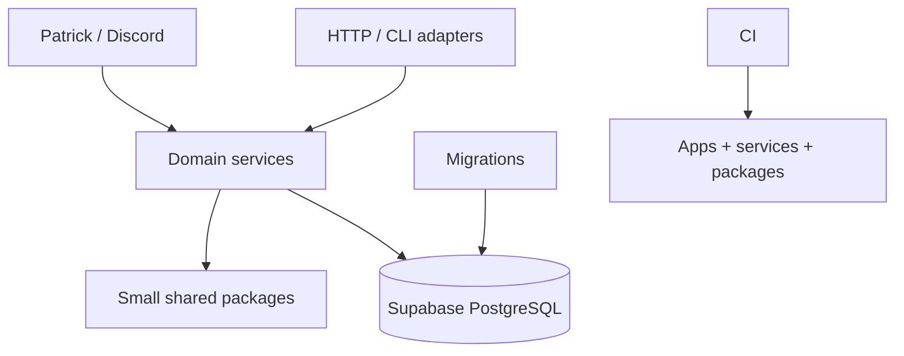
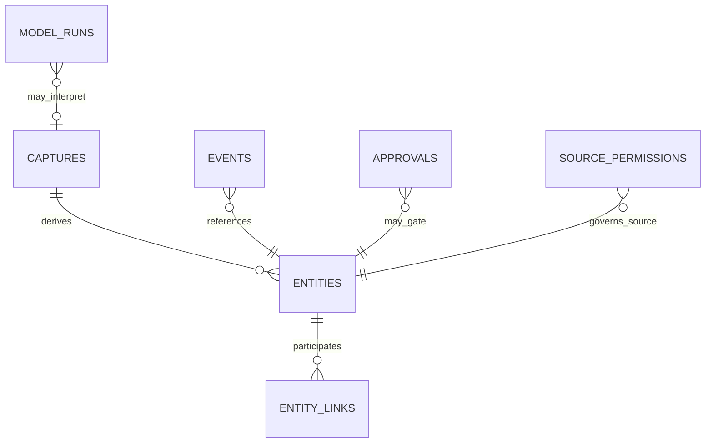

# Platform / Core — Study Guide

[Documentation home](../../README.md) · [OS-wide guide](../../os-study-guide.md) · [User guide](user-guide.md)

## What problem it solves

Platform/Core supplies the smallest shared foundation that lets independently owned systems cooperate: repository structure, database access, generic provenance primitives, permissions, events, observability seams, Discord runtime, CI, and migration discipline. It is deliberately not a “god service.”

The naïve approach is to put every domain in generic JSON tables and let one bot or model reach into all of them. That is quick at first but makes permissions, ownership, migrations, and failures impossible to reason about. Prateek OS instead shares only mechanisms that already have real consumers.

## User/product objective

Provide one coherent private OS surface while keeping domain behavior independently testable, replayable, and replaceable. A new subsystem should reuse identity, provenance, RLS, review, and CI conventions without copying another domain's schema.

## Where it sits in Prateek OS

## Major components

| Component              | Responsibility                                                                     | Inputs / outputs                    | Canonical state                                  |
| ---------------------- | ---------------------------------------------------------------------------------- | ----------------------------------- | ------------------------------------------------ |
| `apps/discord-bot`     | Gateway lifecycle, channel/user gating, commands/reactions/buttons, REST responses | Discord events → typed domain calls | None; durable mappings live in domain/DB records |
| `packages/db`          | Backend Supabase client construction                                               | Backend configuration → client      | None                                             |
| Shared primitives      | Events, captures, entities, links, approvals, model-run/source-permission records  | Domain references and provenance    | PostgreSQL rows                                  |
| `packages/permissions` | Small permission vocabulary/contracts                                              | Source/actor policy → decision      | Permission config and DB records                 |
| Migrations             | Reproducible schema, functions, indexes, constraints, RLS                          | Ordered SQL → database state        | Git history plus migration history               |
| Observability          | Structured, bounded operational evidence                                           | Results/failures → safe logs/status | Domain-specific health/run rows                  |
| CI/tooling             | Consistent revision checks                                                         | Commit SHA → pass/fail evidence     | GitHub Actions run                               |

## End-to-end flow

For a typical Discord action:

1. Gateway receives a platform event with server-assigned actor/channel/message identity.
2. Adapter rejects bots, wrong channels, and unauthorized actors before domain mutation.
3. Domain service validates the request and invokes a repository or database function.
4. PostgreSQL enforces uniqueness, foreign keys, state constraints, and RLS.
5. The domain returns a bounded outcome; the adapter renders a reaction, private response, or button message.
6. A replay uses the same stable identity and converges on the existing record.

## Technology choices

- **Node.js/TypeScript:** one typed runtime across bot, CLIs, workers, HTTP, and tests. No formal language bake-off is recorded.
- **pnpm workspaces:** one lockfile and shared gates, with package promotion only when a consumer exists.
- **PostgreSQL/Supabase:** strong transactions and constraints plus a practical hosted/local toolchain.
- **Discord:** immediate cross-device control surface instead of a custom dashboard.
- **Vitest/ESLint/Prettier/TypeScript/GitHub Actions:** fast local feedback and exact-revision proof.
- **Railway and launchd:** use finite hosted scheduling for JobOps; use local persistence when local tools/private runtime access matter.

Not built: a general event bus, queue platform, dependency-injection framework, vector database, agent framework, or custom authentication system. Those would add cost and new failure modes without a current consumer.

## Data model

The initial shared primitives are intentionally generic but small:

Domain tables such as `jobs` and `personal_ops_tasks` link into shared entities/provenance where useful but keep query-heavy domain fields in typed relational columns.

## Security and privacy

- Every sensitive table is forced-RLS with public roles denied.
- Privileged keys are backend-only.
- Adapter authorization and database authorization are separate layers.
- DEV and PROD credentials are separate; host environment names are not trusted as proof of database target.
- Operational errors are sanitized and bounded.
- Private attachments/artifacts never use public links.
- Migrations include security changes; dashboard state is not an authority.

## Integration architecture

The platform mediates, but does not erase, boundaries:

- Discord Gateway receives interaction events; REST sends notifications and reactions.
- Supabase owns structured state and atomic transitions.
- Railway starts finite JobOps cron runs.
- LaunchAgents supervise Patrick and optional local worker processes independently.
- Google and Gmail adapters expose narrow domain operations and OAuth scopes.
- Model providers sit behind typed provider-neutral seams.

## Deterministic logic

Shared logic favors stable identity, exact state transitions, bounded retries, and explicit versioning. Each domain supplies its own scoring and classification. The platform does not define a universal “importance” score or universal action router.

## LLM/model integration

`packages/llm-router` owns provider-neutral structured invocation behavior, typed errors, and usage. Domain prompt construction and policy stay with the consuming service. This prevents a shared model package from learning Capture or editorial semantics and becoming a hidden domain owner.

## Concurrency, idempotency, and failure recovery

Database uniqueness arbitrates duplicate logical identities. RPCs claim work with expiring ownership and, where needed, unguessable fencing tokens. Persistent state—not memory—records attempts, checkpoints, and terminal outcomes. External delivery is independently acknowledged because a database and an external API cannot share one transaction.

## Testing strategy

Platform tests try to invalidate assumptions at boundaries:

- migration resets prove schema order and database functions against real local PostgreSQL;
- RLS tests confirm public roles cannot read/write;
- config tests ensure missing channel IDs and credentials disable features instead of broadening access;
- Discord command-schema tests protect real platform limits;
- runtime tests cover signal handling, working-directory independence, and supervisor behavior;
- exact-SHA CI proves format/lint/types/tests/build on one immutable revision.

OS0 live acceptance found a dependency-ownership defect: the Discord app consumed packages declared only at the monorepo root. Moving them to the app package made the boundary explicit. A CI runtime deprecation and a formatting-only documentation failure also became part of the recorded closeout rather than being erased.

## Real-world acceptance

Automated tests could not prove Discord authentication/presence, hosted migration history, hosted RLS state, or local supervisor behavior. Those required bounded manual/hosted gates. Acceptance was performed against DEV; PROD remained outside scope.

## Engineering tradeoffs and lessons

- Small shared packages reduce coupling, but some duplication is preferable to a premature framework.
- Backend service-role access is pragmatic, but it does not grant every subsystem informal access to every table.
- Discord is excellent for a private control plane; it is not a durable data store or rich administrative UI.
- A monorepo accelerates coordinated changes, but exact dependency ownership and broad regression gates matter.

## Current limitations

- No general system-control UI or Patrick-wide intent/query router.
- No automatic OS-to-Brain integration.
- Everything accepted in this repository currently targets hosted DEV rather than PROD.
- Platform primitives intentionally do not solve arbitrary workflows; new domain requirements may justify additive primitives later.

## Source map

- `supabase/migrations/20260816000000_shared_primitives.sql`
- `packages/db/src/index.ts`
- `packages/permissions/src/index.ts`
- `apps/discord-bot/src/main.ts`, `config.ts`, `commands.ts`
- `.github/workflows/ci.yml`
- `package.json`, `pnpm-workspace.yaml`, `tsconfig*.json`, `vitest.config.ts`
- `docs/reviews/platform/OS0/`
- `docs/adr/0006-patrick-interaction-identity.md`
- `docs/adr/0008-milestone-identifiers-scheduling-archives.md`
