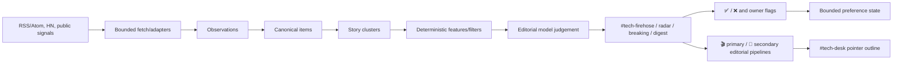
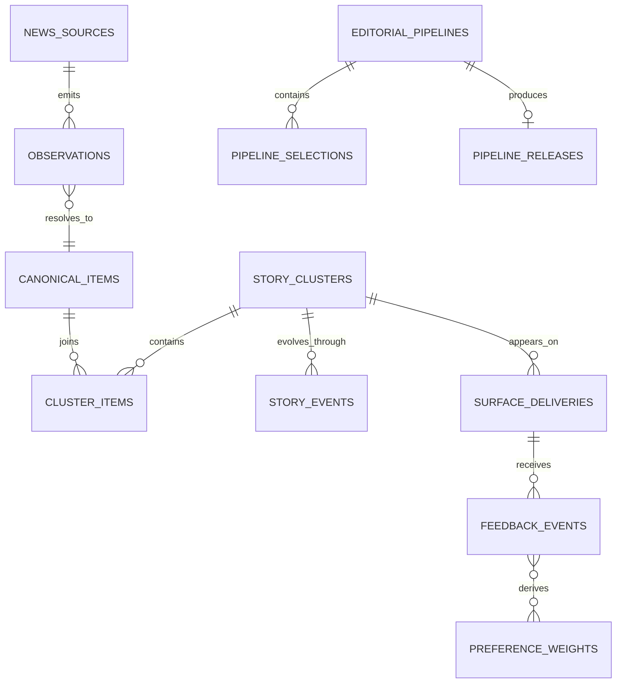

# Tech News Radar — Study Guide

> **Last updated:** 2026-09-19<br>
> **Source repository:** `prateek-os`<br>
> **Source baseline:** accepted cleanup HEAD `d67e5cf543e62636a6dfa0ee96d35835028e1e9d` (derived from canonical `main` `e82862bbbaee4cc7a847897b49ad05c23ceab387`)<br>
> **Source scope:** `services/news-radar/`; N1 paths in `apps/discord-bot/`; `supabase/migrations/`; `docs/adr/0013-n1-tech-news-radar.md`; `docs/adr/0019-n1-centralized-patrick-runtime-and-replay-readiness.md`; and `docs/reviews/news-radar/N1/`<br>
> **Documentation status:** Current

[Documentation home](../../README.md) · [OS model/scoring architecture](../../os-study-guide.md#10-model-and-prompt-architecture) · [User guide](user-guide.md)

> **IMPLEMENTED · HOSTED DEV.** Formally closed and merged into canonical `main` on 2026-09-13 (`1b6e746`/`586d736`). Centralized Patrick runtime on Railway (`patrick-gateway`), Replay Lab, and durable rolling judgment budget are live on hosted DEV. Structured data is housed in a dedicated News Radar Supabase project under the OS4 multi-plane architecture.

## What problem it solves

Tech news is abundant but editorial attention is scarce. A useful radar must notice stories across sources, recognize when several items are the same developing story, distinguish global significance from personal/editorial relevance, learn bounded preferences, surface urgent developments rarely, and help turn selected evidence into an editorial rundown.

The naïve product is an RSS dump or per-article model classifier. That duplicates stories, pays for obvious junk, loses provenance, encourages hallucinated “trending” claims, and cannot explain why a later update belongs to an earlier story. N1's design is evidence-first and cluster-level.

## User/product objective

Build a personalized rolling editorial desk for a recurring tech-news format while also keeping the owner informed. It is not a generic newsletter reader, auto-script writer, or publication bot. The intended surfaces are a browsable ingestion stream, concise curated radar, rare breaking interrupts, daily digest, and a separate editorial desk for user-selected story pipelines.

## Where it sits in Prateek OS



Every box after fetching is present, and the recurring path is live on hosted DEV. The centralized Patrick Gateway (`patrick-gateway`) and background workers run on Railway, while Replay Lab supports deterministic replay and testing without mutating live tables or leases.

## Major components

| Component                   | Responsibility                                                                          | Inputs                        | Canonical/derived outputs                    |
| --------------------------- | --------------------------------------------------------------------------------------- | ----------------------------- | -------------------------------------------- |
| Source catalog              | Versioned, validated source definitions                                                 | JSON config                   | Source identity/transport/cadence            |
| Fetch client/adapters       | Bounded RSS/Atom and Hacker News acquisition; conditional requests                      | Due source                    | Raw observations + fetch health              |
| URL canonicalization/dedupe | Strip tracking/noise and derive strong identity                                         | Source-native ID/URL          | Canonical item identity                      |
| Repository                  | Persist sources, observations, items, links, clusters, events, delivery, feedback, runs | Domain results                | PostgreSQL canonical/audit state             |
| Clustering                  | Bounded deterministic story grouping                                                    | Canonical title/URL/evidence  | Story cluster and membership                 |
| Editorial features          | Cheap pre-model source/convergence/recency/preference signals                           | Cluster evidence              | Derived feature axes                         |
| Editorial model             | Judge novelty/significance/relevance and grounded sentence                              | Filtered cluster bundle       | Structured judgement/usage                   |
| Breaking policy             | Require model flag plus evidence, or explicit owner submission                          | Judgement + convergence       | Promotion decision                           |
| Digest                      | DST-safe 18:30 Vancouver slot and bounded selection/rendering                           | Current story state           | Digest run/delivery                          |
| Feedback                    | Replay-safe ✅/❌ events and bounded term affinity                                      | Reaction identity             | History + derived weights                    |
| Manual submission           | Canonicalize missed URL and diagnose coverage gap honestly                              | Owner URL/surface             | Submission/diagnosis                         |
| Source/flag controls        | Intended `/news-source` and `/news-flag` owner controls                                 | Authorized interaction        | Source state / important-covering flag       |
| Editorial Story Pipeline    | Reaction-driven primary/secondary selections, stash/reset/trim/release                  | Story-linked Discord messages | Pipeline state, selections, release artifact |
| Editorial assist            | Optional grounded outline/stash title with deterministic fallback                       | Real selected evidence        | Pointer outline + model telemetry            |

## Core end-to-end flow

1. A source becomes due and the bounded client sends conditional headers when available.
2. Adapter normalizes valid items; protocol garbage is rejected.
3. A source-native ID or canonical URL forms strong item identity. Exact replay updates recurrence/linkage rather than duplicating.
4. Clustering first honors explicit identity/link evidence, then uses bounded deterministic similarity. A shared company/entity word alone is insufficient.
5. Firehose represents the post-validation, post-dedupe stream before personalized editorial suppression—not raw HTTP noise.
6. Cheap features estimate source strength, convergence, recency, and bounded preference affinity.
7. Only filtered clusters reach editorial model judgement. Grounding validation refuses sentences/links unsupported by the supplied evidence.
8. Radar receives concise useful stories. Breaking needs stronger evidence and is rare. A story may later promote while preserving identity.
9. Deliveries persist per `(story, surface)` identity so each surface is idempotent and reactions map to canonical state.
10. Digest selects a small editorial checkpoint, not a dump.

## Technology choices

- **Adapters plus validated JSON catalog:** add/change sources without hardcoding transport logic.
- **Dependency-light RSS/Atom parser:** fast and sufficient for bounded known feeds; deliberately not a complete XML implementation.
- **Hacker News public API:** inexpensive amplification/social-origin signal.
- **Indirect X/Reddit coverage only:** current direct API economics/terms were judged disproportionate. N1 does not scrape or pretend to have directly read unavailable posts.
- **Brave Search as capped gap discovery:** never primary ingestion; budget refusal returns “skipped.”
- **Deterministic clustering first:** avoids model cost and gives repeatable membership. Model assistance may only inform ambiguous cases under bounds.
- **Cluster-level model judgement:** spends on editorial novelty/significance rather than every raw item.
- **PostgreSQL event/delivery history:** developing stories and feedback need durable, replayable identity.

No vector database, generic event bus, agent framework, auto-publication, or full dashboard is built. The architecture aims to be reusable by a future general News Radar without placing Pirated Sardar-specific assumptions in generic ingestion/identity code.

## Data model



The foundation migration contains source, observation, canonical item/source link, story cluster/membership/event, delivery, feedback, preference, manual submission, flag, model-run, and digest-run state. The local Editorial Story Pipeline migration adds pipelines, selections/reaction identities, and release artifacts/functions.

Raw evidence retains URL/source/fetch/publish timestamps and bounded text. Full copyrighted bodies are not stored merely because a fetch succeeded. Scores, summaries, sentences, preference aggregates, and outlines are derived/rebuildable.

## Security and privacy

- All N1 tables in the local migration use forced RLS and backend-only privileged access.
- Source/service keys never go to Discord/client code.
- Fetches have scheme, redirect, response-size, timeout, and rate boundaries.
- One source failure cannot corrupt existing stories or fail unrelated sources.
- X/Reddit are never scraped or dereferenced as if direct integration existed.
- Owner feedback/preference state is private even when linked articles are public.
- Model output cannot introduce a link absent from its evidence bundle.
- Discord reaction/command handlers are intended to verify actor and eligible channel before mutation.
- Cost guards run before Brave/model calls.

Hosted-DEV activation evidence supports the intended RLS/service-only posture and constrained RPC surface. The corrected activation authority records delta review and hosted reverification; nothing implies owner acceptance, PROD deployment, merge, or formal milestone closeout.

## Integration architecture

### Intended Discord surfaces

| Surface          | Intended role                                                                                                      |
| ---------------- | ------------------------------------------------------------------------------------------------------------------ |
| `#tech-firehose` | Human-visible post-validation stream before editorial ranking suppression; notifications can be muted by the user. |
| `#tech-radar`    | Primary rolling one-sentence/one-link editorial TLDR.                                                              |
| `#tech-breaking` | Rare high-significance interrupt; may promote an existing Radar story.                                             |
| `#tech-digest`   | Daily compact checkpoint at 18:30 `America/Vancouver`.                                                             |
| `#tech-desk`     | Editorial Story Pipeline status and released pointer outlines.                                                     |

The configuration, commands, reaction routing, and scheduled delivery surfaces were registered in hosted DEV. Correction delta review and reactivation checks passed; batched owner acceptance remains pending.

### Sources and Brave

The inspected catalog contains a bounded set of real tech/editorial sources spanning general publications, Apple-focused sources, aggregation/HN, and a creator signal. The exact private operating list is not reproduced. Hosted-DEV evidence verified bounded recurring RSS/HN ingestion and source-local health, including post-correction reverification.

### Model providers

N1 has its own editorial provider interface and Gemini/OpenAI implementations. A bounded real bake-off selected a fast low-cost Gemini model as default and retained an OpenAI alternate. The selected default has run in hosted-DEV editorial surfacing with bounded cost accounting. Release outlines and stash titles use a separate editorial-assist interface with deterministic fallback and model-run telemetry.

## Deterministic logic

### Identity and dedupe

Canonicalization lowercases host/scheme, removes fragments/default ports/tracking parameters, and sorts relevant query parameters. Source-native ID takes precedence where available; canonical URL is the fallback. Unbounded fuzzy matching cannot merge.

### Clustering

Early clustering used token similarity plus minimum shared-token rules. Adversarial review exposed genre/source-template artifacts that could overmerge unrelated stories. The in-progress correction added a larger adversarial corpus, discriminative-token/genre denylisting, and evaluation for both overmerge and undermerge. Explicit same-story links remain authoritative. Clustering debt must be rechecked at closeout because this code is still local.

### Two editorial axes

- **Global significance:** would a serious tech follower need to know?
- **Owner/editorial relevance:** is it particularly valuable for this format or the owner's interests?

They remain separate so negative preference cannot bury major news and niche affinity cannot masquerade as global importance.

### Breaking and digest

Breaking is conservative: a model recommendation alone is insufficient without stronger convergence/significance evidence, except an explicit owner submission to the Breaking surface. Digest scheduling resolves Vancouver local 18:30 through timezone-aware calendar math, including DST, and selects bounded categories without padding quiet days.

### Feedback

✅ creates bounded positive preference evidence; ❌ creates bounded negative evidence, never deletion or a permanent blacklist. Reaction replay keys ensure at-most-once application. The local repository currently records an accepted race debt in non-atomic preference-weight accumulation; it has no concurrent caller today and must be revisited before concurrent activation.

## LLM/model integration and prompt engineering

### Editorial judgement

The model receives one filtered story cluster with bounded evidence and deterministic features. It judges what is new, significance, owner relevance, follow-up materiality, and concise grounded wording. The output is schema-validated; retries are bounded; failure preserves the cluster and uses safe fallback/defer behavior.

    SYSTEM:
    Evaluate one story cluster from supplied evidence only.
    Separate global significance from editorial relevance.
    Do not claim velocity, confirmation, source identity, or social traction
    unless the evidence explicitly supports it.

    OUTPUT:
    {
      "is_newsworthy": true,
      "global_significance": 0,
      "editorial_relevance": 0,
      "breaking_candidate": false,
      "radar_sentence": "..."
    }

The real bake-off used a frozen synthetic corpus across both providers and measured schema success, accuracy, grounding, latency, and cost. Both were strong on the small clean corpus; the selected provider was materially faster and slightly more conservative on the Breaking axis. The record explicitly does not claim variance testing, messy live-cluster performance, or live activation.

### Pointer-based release outline

The Editorial Story Pipeline does not generate a spoken script. A release groups selections by current story identity and produces sections with real links, short grounded synopsis, “sure to mention,” “might mention,” and follow-ups. Validation rejects invented links, missing/duplicate arcs, overlong script-like prose, and unsupported grouping. On provider failure or ungrounded output, a deterministic outline preserves every selected evidence pointer.

### Stash naming

An owner-supplied name wins. Otherwise the assist model may see actual selected story titles—not opaque hashes—and propose a bounded title. Failure falls back to a deterministic date-based unique name. Both success/failure attempts are recorded without blocking the stash.

Full production prompts and private preference state are not published.

## Editorial Story Pipeline (in-progress design)

The pipeline helps collect a rundown without turning each reaction into a script.

### Reaction semantics

- **🎬 primary:** on a resolvable story message in Firehose/Radar/Breaking, lazily creates the one active primary pipeline or adds to it.
- **🧵 secondary-active:** adds to the currently active secondary pipeline. With no secondary active, it is a deliberate no-op and the ineffective reaction is removed. It never creates a primary.
- Removing a selector reaction removes only the matching selection, replay-safely.
- Digest is not eligible because one digest message can represent several canonical stories.

### Commands

The in-progress `/news-pipeline` surface includes:

- `status`
- `stash [name]`
- `secondary-activate <stash>`
- `reset-primary`
- `reset-secondary`
- `trim-primary` with an absolute/deterministic cutoff or hours (default convenience window)
- `release-primary`
- `release-secondary`

Stashing preserves selections and vacates the primary slot; the next 🎬 creates a new primary. Activating a stash as secondary demotes the old secondary back to stashed without losing content. Full reset clears selections/reactions and leaves a durable tombstone. Only primary has bounded trim. Release persists the artifact before marking the pipeline released and clearing selections.

### Safe release sequence

```mermaid
sequenceDiagram
    participant U as Owner
    participant D as Discord router
    participant DB as PostgreSQL
    participant E as Evidence repository
    participant M as Optional assist model
    U->>D: /news-pipeline release-primary
    D->>DB: begin/freeze release (fenced)
    D->>E: load real selected evidence
    D->>E: re-resolve current cluster membership
    D->>M: optional grounded outline
    M-->>D: structured outline or failure
    D->>D: validate; deterministic fallback if needed
    D->>DB: persist artifact first, then mark released/clear selections
    D-->>U: pointer outline in #tech-desk
```

Any failure before artifact persistence aborts release and leaves pipeline/selections intact for retry. Duplicate and reset-versus-release races are fenced so exactly one terminal operation wins.

No real outline was released to `#tech-desk` in the inspected evidence.

## Concurrency, idempotency, and failure recovery

- Canonical item/source links and cluster membership are exactly-once.
- A review-found bug that created orphan clusters on repeated CLI ingest was fixed with existing-state loading and an integration regression.
- Delivery keys are surface-specific and idempotent.
- Feedback uses reaction replay identity.
- Pipeline first-🎬 creation has a database uniqueness/race fence.
- Selection add/remove is replay-safe; the same story may legitimately appear in multiple pipelines and multiple evidence items from one story may remain.
- Stash/secondary activation races enforce one primary and one secondary.
- Reset versus release allows one winner.
- Release freezes, loads/re-resolves, validates, persists artifact, then clears. Abort restores retryability without evidence loss.
- Source failures retain last attempt/success and remain isolated.
- Model failure never deletes canonical evidence; telemetry records success, error, or ungrounded fallback when possible.

## Testing strategy

| Test family            | What it tries to break                                                                                                                                                  |
| ---------------------- | ----------------------------------------------------------------------------------------------------------------------------------------------------------------------- |
| URL/dedupe             | tracking/query variants, fragments, missing identity, overlong fields, replay                                                                                           |
| Feed adapters          | RSS/Atom variants, missing links, malformed items, HN deleted/dead items, response byte/time bounds                                                                     |
| Repository integration | real local migration, item upsert, link recurrence, cluster exact-once, delivery dedupe, feedback replay                                                                |
| Clustering             | shared generic entity, product/version updates, unrelated same-genre headlines, undermerge of developing evidence, adversarial corpus                                   |
| Editorial              | malformed schema, provider timeout, hallucinated source/velocity, grounding, fallback, two-axis separation                                                              |
| Digest                 | Vancouver DST, before/after slot, sparse/busy selection, length limits, retry/claim state                                                                               |
| Cost/Brave             | daily/monthly cap, refusal before network, truthful usage                                                                                                               |
| Discord                | missing channel fail-closed, authorized actor, command limits, URL-only manual submission, ✅/❌ replay                                                                 |
| Pipeline               | concurrent first 🎬, duplicate add/remove, stash collision, secondary race, trim cutoff, full reset, duplicate/concurrent release, abort preservation, reset-vs-release |
| Outline                | grouping current story arcs, invented links, missing/duplicate sections, script-like prose, provider failure, deterministic floor, telemetry on failed persistence      |

The first implementation was test-first and supplemented by real local Postgres and live public-feed smoke. Review then found an important gap: the CLI initially failed to load existing clustering state, so repeat ingestion created orphan clusters. A targeted integration test reproduced the exact production calling pattern before correction. Later review found stash naming passed identity hashes rather than story titles and failed to record model attempts; production wiring and tests were corrected. Model telemetry is best-effort so logging failure cannot invalidate an already persisted release.

The Waveform retrospective is explicitly a coverage plausibility proxy, not historical recall proof. It identified likely catalog gaps for automotive technology, Android-specific depth, and diffuse creator-discourse trends while avoiding fabricated claims that N1 would have surfaced old stories it never ingested.

## Real-world acceptance

Evidence completed locally includes:

- migrations applied to real local Supabase;
- repository integration against real PostgreSQL;
- bounded live public-feed ingestion and health/report checks;
- a small real paid editorial provider bake-off;
- source-coverage retrospective using public information;
- multiple independent local reviews and correction passes.

Hosted-DEV migration/configuration, recurring runtime observation, Discord registration, and post-correction reactivation/reverification occurred. Still required before formal closeout:

- batched owner testing of source controls, flags, feedback, manual submissions, digest quality, and pipeline reactions/commands;
- one owner-accepted small pipeline release to `#tech-desk` with evidence/cost verification;
- final milestone reconciliation, merge decision, and closeout gate.

## Engineering tradeoffs and lessons

- Cluster before paying for editorial judgement.
- Separate significance from preference.
- Preserve observations and story events so a developing story is explainable.
- A clean synthetic bake-off is useful but cannot prove messy production behavior.
- “Indirect social coverage” must be labeled honestly; absence of direct API access matters.
- Deterministic fallback makes model-assisted release resilient without making the model irrelevant.
- Reaction identity must map to canonical records, not rendered text.
- Adversarial clustering corpora are essential because ordinary positive examples hide catastrophic overmerge.

## Current limitations

- Implemented and accepted on hosted DEV; routine operation targets DEV rather than hosted PROD.
- Direct X/Reddit integration is explicitly excluded; indirect coverage is incomplete.
- Current RSS parser is bounded, not a full XML implementation.
- Source catalog has known topical asymmetries.
- Preference accumulation has an accepted low-practical-risk non-atomic update debt before concurrent writers exist.
- Model bake-off was small/single-run and used clean evidence.
- No contemporaneous long-running editorial quality/recall measurement exists; activation evidence is an initial operational window.

## Source map

- `docs/adr/0013-n1-tech-news-radar.md`
- `services/news-radar/src/source-config.ts`, `fetch-client.ts`, `rss-adapter.ts`, `hn-adapter.ts`
- `services/news-radar/src/url-canonicalization.ts`, `dedupe.ts`, `clustering.ts`, `repository.ts`
- `services/news-radar/src/editorial-features.ts`, `editorial-model.ts`, `breaking-promotion.ts`
- `services/news-radar/src/digest.ts`, `digest-scheduler.ts`, `feedback.ts`, `manual-submission.ts`, `cost-tracking.ts`, `brave-client.ts`
- `services/news-radar/src/pipeline-decisions.ts`, `pipeline-repository.ts`, `pipeline-commands.ts`, `pipeline-release.ts`, `pipeline-release-service.ts`
- `services/news-radar/src/editorial-assist-provider.ts`, `editorial-outline-prompt.ts`
- `apps/discord-bot/src/news-radar.ts`, `news-pipeline.ts`, `news-pipeline-router.ts`
- `supabase/migrations/20260914000000_n1_news_radar_foundation.sql`, `20260915000000_n1_editorial_story_pipeline.sql`
- `docs/reviews/news-radar/N1/`
