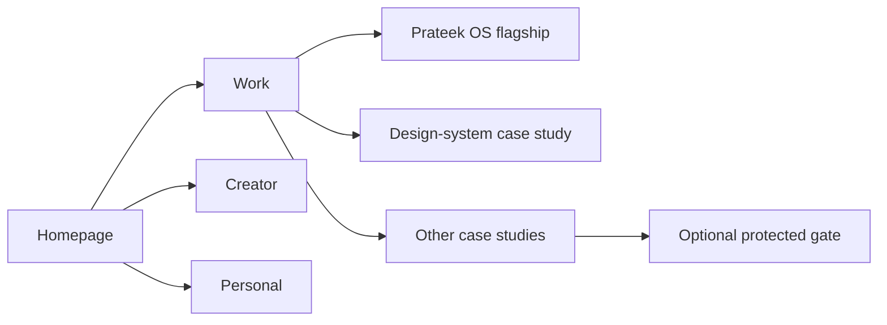
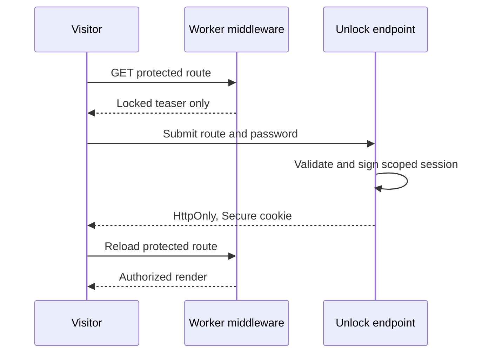

# Prateek Web — Study Guide

> **Last updated:** 2026-09-19<br>
> **Source repository:** `prateek-web`<br>
> **Source baseline:** canonical `main` `007ad31bbfc481ca7621da64cdb7593060aab5c2`<br>
> **Source scope:** `src/`; `public/`; `scripts/`; `e2e/`; `package.json`; `astro.config.mjs`; `playwright.config.ts`; `vitest.config.ts`; `wrangler.jsonc`; `PROJECT_HANDOFF.md`; and `docs/`<br>
> **Documentation status:** Current

[Documentation home](README.md) · [User guide](user-guide.md) · [Status](STATUS.md)

## 1. Product goal and information architecture

The site is optimized for a recruiter or hiring manager to form a correct, credible view quickly. Work is primary; Creator is secondary; Personal is tertiary. That priority shapes both navigation and content depth: the homepage establishes identity and credibility, `/work` exposes the portfolio hierarchy, and the Prateek OS flagship receives a deeper system narrative than breadth projects.



The separation is semantic, not separate applications. All routes share the same Astro project, layout foundation, design tokens, and deployment.

## 2. Why Astro, with selective React

Astro fits a content-heavy portfolio because most pages can become static HTML while the few stateful interactions remain isolated. File-based routes make the information architecture visible in `src/pages/`; `.astro` components keep markup and styles close; the Cloudflare adapter supports the small server-side surface.

React 19 is not the default rendering layer. It is used for interaction that benefits from component state, notably the protected-case-study dialog and the interactive skills grid. This “islands” split limits browser JavaScript without forcing every interaction into imperative DOM code.

This rationale is partly an inference from the implemented split and the W1 product constraints; the inspected source does not contain a formal framework bake-off.

## 3. Rendering and routing

Most visitor pages are prerendered content routes. Astro's router supplies transitions and preserves normal navigation semantics. Two API routes and protected pages provide the server boundary:

```text
static/prerendered page request → Cloudflare asset response
protected page request          → middleware verifies scoped session → locked or authorized render
unlock request                  → server validates input → signed HttpOnly cookie → reload
analytics event                 → validate categorical payload → optional binding or safe no-op
```

The canonical origin is configured once for canonical tags and sitemap generation. The sitemap excludes the protected reference route and 404 page; robots rules also exclude API and protected surfaces. Normal trailing-slash redirects are deployment behavior, not duplicate routes.

## 4. Content architecture: typed repository data, not MDX

Astro's MDX integration is installed, but current production content does **not** use an MDX collection or CMS. Identity, projects, skills, Creator entries, Personal entries, site links, and the Prateek OS chapter model live in typed `src/data/*.ts` modules. Pages assemble those records through layouts and reusable components.

This choice gives content changes compile-time structure and makes regression tests straightforward. The tradeoff is that an owner edits TypeScript and runs the code-quality gates rather than using a nontechnical editor. A future MDX or CMS move should therefore be treated as an architecture change, not described as current behavior.

## 5. Component and layout system

`BaseLayout.astro` owns shared SEO, navigation, footer, skip link, view transitions, reveal observation, and categorical analytics delegation. `CaseStudyLayout.astro` and case-study components provide reusable long-form structure. Shared navigation, section rails, status badges, project cards, cross-section links, and illustrative visuals prevent route-by-route drift.

The design system has three layers:

1. **Primitive tokens** define raw color ramps, space, type, radius, shadow, motion, z-index, and widths.
2. **Semantic tokens** name roles such as page surface, primary text, accent, and section spacing.
3. **Component bindings** specialize narrow needs such as glass and navigation material.

Tailwind CSS 4 provides the `@theme` token foundation and utility base, but the site is not organized around long utility-class compositions. Hand-authored CSS and semantic custom properties remain the public visual contract. Theme scopes rebind semantic roles for Work, Prateek OS, Creator, and the warm-light Personal surface.

Typography uses a system sans/serif pairing, avoiding third-party font requests. The current rules define stable type roles and card/CTA families so visual hierarchy is repeatable rather than page-specific.

## 6. Interaction and performance

Motion communicates state or hierarchy: section tracking, shared-element page transitions, reveal-on-entry, navigation expansion, and small CTA movement. It is disabled or simplified for reduced-motion preferences. There is no scroll hijacking, splash screen, forced intro, or decorative sound.

Performance choices visible in source include:

- static output for content routes;
- React only for stateful islands;
- system fonts;
- one shared reveal observer instead of per-component listeners;
- on-demand loading for the design-system responsive preview;
- repository-local assets and deliberate placeholders;
- analytics that disappear safely when optional configuration is absent.

The remaining long mobile design-system page and its focusable preview iframe are accepted polish/debt items, not hidden regressions.

## 7. Protected case studies

Protection is server-enforced. A route allowlist maps protected paths to server-side configuration. Middleware verifies a route-scoped, expiring HMAC session token before the page decides whether to render gated content. The browser-side React dialog submits a password but never receives the configured secret or protected body.



The current protected route is a synthetic reference fixture, not private portfolio material. It is `noindex` and excluded from the sitemap. Tests confirm unauthorized HTML does not contain the gated payload, forged or wrong-scope tokens fail, expiry is enforced, and reduced-motion behavior remains accessible.

This design raises the bar substantially over CSS blur, but it is a shared-password gate, not a complete identity system. The inspected unlock endpoint has no per-client rate limiter, and issued stateless sessions have no individual revocation path before their two-hour expiry. Protected content therefore also depends on strong secret management, HTTPS, upstream abuse controls, scoped sessions, and careful logging. Credentials never belong in this repository or these docs.

## 8. Accessibility and responsive behavior

The implementation uses semantic landmarks, ordered headings, a keyboard-focusable skip link, visible focus, native dialog behavior, appropriate ARIA state, and touch-capable navigation. Desktop section rails collapse to a horizontal mobile strip, and grids recompose rather than merely shrink.

Playwright exercises desktop and mobile projects. Axe scans the major public routes and locked state for serious/critical violations. Specific interaction tests cover keyboard navigation, reduced motion, section tracking, protected-route focus and errors, and responsive layout. Automated checks do not replace human visual review, which remains part of W1 closeout.

## 9. Analytics, security, and privacy

Cloudflare Web Analytics is optional and omitted entirely when its public token is absent. Custom events use a bounded categorical schema such as route or project-open actions; the server validates before forwarding to an optional analytics binding and safely no-ops without one. The design avoids fingerprinting and free-form personal payloads.

Environment access is server-oriented. Secrets are configured outside Git. Public docs intentionally omit account, resource, deployment-version, and credential identifiers. Security-sensitive routes fail closed when configuration is missing.

## 10. Build, validation, and deployment

The repository's documented gate is:

```sh
pnpm check
pnpm lint
pnpm lint:css
pnpm check:tokens
pnpm check:copy
pnpm format:check
pnpm test
pnpm test:e2e
pnpm build
```

Vitest protects analytics validation, signed-session behavior, content-data invariants, status mappings, motion/contrast helpers, and design-quality contracts. Playwright protects navigation, route rendering, case-study structure, mobile interactions, visual-system contracts, protected flow, and accessibility. Custom token and copy scripts catch design-system drift not covered by generic linters.

Production uses the Astro Cloudflare adapter and Cloudflare Workers with static assets. Deployment is currently manual; there is no repository CI/CD workflow. The deployment record distinguishes the running application SHA from later documentation commits on `main`.

## 11. Tradeoffs and debt

- Repository-first typed content is simple and testable, but requires code review for editorial updates.
- Prerendering provides fast pages; protected content and API actions intentionally opt into server execution.
- React islands contain complexity, but create a second component idiom that should remain narrowly used.
- Hand-authored design tokens produce a distinctive, auditable system, but spacing literals and contrast-preset-to-selector linkage are not fully enforced.
- Illustrative project visuals preserve layout and storytelling while real assets are unavailable, but each must be reviewed when final evidence arrives.
- Manual deployment keeps infrastructure simple but makes disciplined release records and smoke tests essential.

W1 is closed; W2 is in progress: W2.5 is complete and deployed, with final W2 visual acceptance pending owner signoff on branch `fix/final-w2-production-acceptance` (`eb1b423f3e4d69162f9547dc65f6e724d12c3899`). Future work continues for real approved media, Creator analytics, Personal writing/art, and further token enforcement.
